# Java-Cucumber-01
https://perficient.udemy.com/course/selenium-con-java-y-cucumber-el-curso-definitivo/learn/lecture/41595708#overview
## Prerrequisitos
1. Tener "[Visual Studio Code](https://code.visualstudio.com/download)", como editor
2. Tener Instalado "[JAVA Version 11.0.2](https://jdk.java.net/archive/)", "[GRADLE](https://gradle.org/install/)", "[GROOVY](https://groovy.apache.org/download.html)" y "[MAVEN](https://maven.apache.org/download.cgi)".
3. Instalar Estas Extensiones en el "Visual Studio Code":
* code-groovy  de Marlon Franca.
* Cucumber de Cucumber.
* Cucumber (Gherking) Full de Alex Krechik.
* Debugger for Java de Microsoft.
* Extension Pack for Java de Microsoft.
* Gradle for Java de Microsoft.
* Gradle Language Support de Narco Siren.
* Groovy Lint, Fromat and de Nicolas Vuillamy.
* Language Support for Java de Red Hot.
* Maven for Java de Microsoft.
* Project Manager for Java de Microsoft.
* Snippets and Sintax High de Euclidity.
* Test Runner for Java de Microsoft.

## Paso 07
1. Crear un Proyecto con "Gradle: Create a Gradle Java Project".
2. Seleccionamos la carpeta en:
```dos
 E:\Development\tutorials\java\cucumber\SeleniumFreeRange
 ```
3. Seleccionamos "Groovy".
4. Dejamos el nombre por defecto.
5. Movemos la carpeta "src" y el "build.gradle" a la raíz del proyecto.
6. Borramos la carpeta "app" y lo q tiene por dentro.
7. Borramos el archivo "App.java" dentro de "/src/main/java/java/cucumber".
8. Borramos el archivo "AppTest.java" dentro de "src/test/java/java/cucumber".

## Paso 09
1. Del archivo **build.gradle** borramos la sección "application".
2. Del sitio [Maven Repository](https://mvnrepository.com/) buscamos "Selenium Java".
3. Seleccionamos la última (para este ejercicio fue 4.17).
4. Seleccionamos el "Gradle (Short)", con el click, esto queda en la memoria para darle "pegar" en cualquier parte.
5. Lo pegamos en la sección "dependencies" de **build.gradle**.
6. En el mismo sitio donde tomamos las dependencias, buscamos "TestNG", va en la version 7.9, mismo copiar para "dependencies" de **build.gradle**.
7. En el mismo sitio donde tomamos las dependencias, buscamos "Cucumber JVM: Java", va en la version 7.15, mismo copiar para "dependencies" de **build.gradle**.
8. En el mismo sitio donde tomamos las dependencias, buscamos "Cucumber JVM: JUnit 4", va en la version 7.15, mismo copiar para "dependencies" de **build.gradle**. 
> [!IMPORTANT]  
> Las versiones de "Cucumber JVM: Java" y "Cucumber JVM: JUnit 4", **TIENEN** q ser iguales.
16. Borramos de "Depencies" el de "google.guava".
17. Ejecutamos un comando en la `TERMINAL` llamado
```bash
gradle build
```
Y esto baja todas las dependencias, al final debe mostrar algo parecido a esto:
```diff
+ BUILD SUCCESSFUL in 29s
4 actionable tasks: 4 executed
```
## Paso 11
> [!NOTE]  
>Tenemos 2 arquitecturas  
> Opción 1  

|Main|Test|
|---|---|
| * Pages  | * Step Definitions |
| * Runner | * Feature |
|||

> Opción 2

|Main|Test|
|---|---|
|| * Step Definitions|
|| * Feature |
|| * Pages |
|| * Runner |

> Se sugiere utilizar la opción 2, por tanto la carpeta "Main" puede ser borrada.

1. Borrar la carpeta "Main" dentro de "src".
2. Adicionar la carpeta "features" dentro de "/src/test/resources".
3. Adicionar la carpeta "pages" dentro de "/src/test/java".
4. Adicionar la carpeta "steps" dentro de "/src/test/java".
5. Adicionar la carpeta "runner" dentro de "/src/test/java".

## Paso 13
1.  Del sitio [Maven Repository](https://mvnrepository.com/) buscamos "bonigarcia" y de alli seleccionamos el "WebDriverManager"
2. Seleccionamos la última (para este ejercicio fue 5.6.3).
3. Seleccionamos el "Gradle (Short)", con el click, esto queda en la memoria para darle "pegar" en cualquier parte.
4. Lo pegamos en la sección "dependencies" de **build.gradle**.
5. Creamos el archivo **FreeRangeTest.java** y en la carpeta "pages" con la siguiente información:
```java
package pages;

import org.openqa.selenium.WebDriver;
import org.openqa.selenium.chrome.ChromeDriver;
import org.testng.annotations.AfterMethod;
import org.testng.annotations.BeforeMethod;
import org.testng.annotations.Test;
import io.github.bonigarcia.wdm.WebDriverManager;

public class FreeRangeTest {
    private WebDriver driver;
    @BeforeMethod
    public void setUp() {
        // Inicializa el WebDriver para Chrome 
        WebDriverManager.chromedriver().setup(); driver = new ChromeDriver();
    }
    @Test
    public void navegamosAFreeRangeTesters() { 
        // Navega a la página web
        driver.get("https://www.freerangetesters.com");
    }
    @AfterMethod
    public void tearDown() {
        // Cierra el navegador después de la prueba
        if (driver != null) {
            driver.quit();
        }
    }
}
```
6. Presionamos el triángulo verde dentro del archivo **FreeRangeTest.java**, corre y prueba q abre el navegador y luego lo cierra.  
En el `DEBUG CONSOLE`, debe aparecer una respuesta similar a este:
```dos
===============================================
Default Suite
Total tests run: 1, Passes: 1, Failures: 0, Skips: 0
===============================================
```

7. Para confirmar este debe ser el archivo **build.gradle**:
```gradle
plugins {
    // Apply the application plugin to add support for building a CLI application in Java.
    id 'application'
}

repositories {
    // Use Maven Central for resolving dependencies.
    mavenCentral()
}

dependencies {
    // Use JUnit Jupiter for testing.
    testImplementation 'org.junit.jupiter:junit-jupiter:5.9.1'

    // https://mvnrepository.com/artifact/org.seleniumhq.selenium/selenium-java
    implementation 'org.seleniumhq.selenium:selenium-java:4.17.0'

    // https://mvnrepository.com/artifact/org.testng/testng
    testImplementation 'org.testng:testng:7.9.0'

    // https://mvnrepository.com/artifact/io.cucumber/cucumber-java
    implementation 'io.cucumber:cucumber-java:7.15.0'

    // https://mvnrepository.com/artifact/io.cucumber/cucumber-junit
    testImplementation 'io.cucumber:cucumber-junit:7.15.0'

    // https://mvnrepository.com/artifact/io.github.bonigarcia/webdrivermanager
    implementation 'io.github.bonigarcia:webdrivermanager:5.6.3'
}

tasks.named('test') {
    // Use JUnit Platform for unit tests.
    useJUnitPlatform()
}
```

## Paso 18
> [!NOTE]  
> Veamos que es el Page Object Model (POM)  
> Pasando de esto:

|Page Object Class|Tests|
|---|---|
|Elemento Boton| Click Botón|
||Validar botón habilitado|
|Elemento Campo Texto||
|Click Botón||


> A esto

|Page Object Class|Steps Def|Feature|
|---|---|---|
|Elemento Boton| Click Botón||
||Validar botón habilitado||
|Elemento Campo Texto|||
|Click Botón|||
|||Dado que hago algo|
|||Cuando miro|
|||Paso lo q esperaba|

1. Completamos en **FreeRangeTest.java** un método llamado `test1`, con lo siguiente:
```java
    @Test
    public void test1() { 
        // Navega a la página web
        driver.get("https://www.freerangetesters.com");
        // Encuentra un elemento utilizando si ID
        WebElement elementoPorId = driver.findElement(By.id("idDelElemento"));
        elementoPorId.click();
    }
```
2. Creamos en "src/test/resources/" un archivo llamado **FreeRangeNavegation.feature**.
3. Creamos en "src/test/runner/" un archivo llamado **TestRunner.java**.
4. Colocamos `fea`dentro del archivo **FreeRangeNavegation.feature**, y el snippet completa el resto, similar a esto:
```feature
Feature: Feature name
    In order to value
    As a role
    I want reature 
```
5. Colocamos `sce`dentro del archivo **FreeRangeNavegation.feature**, y el snippet completa el resto, similar a esto:
```feature
Scenario: title
    Given context
    When event
    Then outcome
```
6. Coloco datos para corre dentro de **TestTunner.java**:
```java
@RunWith(Cucumber.class)
@CucumberOptions(
    features = "src/test/resources",  //Directorio de archivos .feature
    glue = "src/test/java/steps",  //Paquete de las Clases de los pasos del feature
    plugin = {"pretty", "html:target/cucumber-reports"}
)  
```
7. En la `TERMINAL`, simplemente ejecuto el comando:
```bash
gradle test
```
y mi respuesta es similar a esto:
```diff
+ BUILD SUCCESSFUL in 8s
3 actionable tasks: 3 executed
```
8. Del archivo **build.gradle**, cambiamos la última linea de `tasks.named('test') {`, por esta:
```gradle
tasks.named('test') {
    systemProperty "cucumber.options", System.getProperty("cucumber.options")
}
```
9. En la `TERMINAL`, simplemente ejecuto el comando:
```bash
gradle test
```
y mi respuesta es similar a esto, debe salir una falla:
```diff
- BUILD FAILED in 2s
 3 actionable tasks: 1 executed, 2 up-to-date
```
10. Borramos del archivo **settings.gradle** la última linea
```gradle
include('app')
```

## Paso 20
1. Borramos las dos últimas líneas del archivo **FreeRangeNavegation.feature**, dejando solo esto:
```feature
Feature: Navigation bar
    To see the subpages
    Without logging in
    I can click the navigation bar links
 
Scenario: I can access the subpages through the navigation bar 
    Given I navigate to www.freerangetesters.com 
```
2. Creamos un archivo en "src/test/java/pages" llamado **BasePage.java**, 
allí se crea la instancia de la *webPage*, que será exclusiva de este archivo 
y los demás podrán utilizar el `WebDriver`.
3. Creamos una variable estática llamada `driver` de tipo `WebDriver`. El solito debe importar el faltante `import org.openqa.selenium.WebDriver;`.
4. Añadimos un `WebDriverWait` en una variable `wait`, iniciando la instancia. El importará `import org.openqa.selenium.support.ui.WebDriverWait;`.
5. Esta misma fórmula requiere un `Duration.ofSeconds(5)`, por ende esta la importará así `import java.time.Duration;`.
6. Creamos un bloque estático, sin nombre como este:
```java
    static {
        WebDriverManager.chromedriver().setup();
        driver = new ChromeDriver();
    }
```
El debió de importar lo siguiente: `import io.github.bonigarcia.wdm.WebDriverManager;` y `import org.openqa.selenium.chrome.ChromeDriver;`.
7. Cuando se esté utilizando esta página heredada, se va a requerir el constructor y q sea vista por otras clases:
```java
    public BasePage(WebDriver driver){
        BasePage.driver = driver;
    }
```
8. Creamos una función dentro del mismo archivo **BasePage.java**, para poder acceder al respectivo sitio o URL, requerido:
```java
    public static void  navigateTo( String url){
        driver.get(url);
    }
```

## Paso 22
1. Creamos archivo **PaginaPrincipal.java**, dentro de "src/test/java/pages".
2. Conectamos la **BasePage.java** mediante un `extends`.
3. Creamos un constructor:
```java
    public PaginaPrincipal(){
        // Se llama el Constructor Padre
        super(driver);
    }
```
4. Creamos un método para navegar a `www.freerangetesters.com`:
```java
    public void navigateToFreeRangeTesters(){
        navigateTo("https://www.freerangetesters.com");
    }
```
5. Ahora si creamos los *steps* con el archivo **FreeRangeSteps.java** dentro de "src/test/java/steps".
6. Basado en el arcivo **FreeRangeNavegation.feature** Escribimos el paso tal cual, letra por letra : 
`@Given ("I navigate to www.freerangetesters.com")`, 
el luego importará `import io.cucumber.java.en.Given;`.
7. Creamos un método, para luego ser utilizado:
`public void iNavigateToFRT(){}`.
8. Importamos del archivo **PaginaPrincipal.java** , el valor en una instancia llamada `landingPage`.
```java
PaginaPrincipal landingPage = new PaginaPrincipal();
```
9. Usando `landingPage`, llamamos métodos como el de `navigateToFreeRangeTesters()`.
10. Del archivo **TestRunner.java** , cambiamos el glue a solo `steps`.
11. ejecutamos en la `TERMINAL`, el comando siguiente:
```bash
gradle test
```
Y el resultado obtenido debe ser, una ejecución exitosa:
```diff
+ BUILD SUCCESSFUL in 11s
 3 actionable tasks: 3 executed
```

## Paso 24
> [!TIP]  
> Descargamos para Chrome y/o FireFox una extensión llamado **selectorsHub**, 
> luego ubicándonos en el botón requerido, click derecho, SelctorsHub
> y `Copy Relative XPath`, el contenido lo usaremos en el paso siguiente.

## Paso 25
> [!NOTE]  
> Vamos a enfocarnos en el archivo **BasePage.java**, dado q no pertenece a ninguna página en particular, 
> utilizándose como un genérico para el Page Object Class (POC),
> como vamos a interactuar con elementos Web, habrá q poner esperas. 
> 

1. En el archivo **BasePage.java** creamos un elemento del tipo `WebElement` con el nombre `Find` y un argumento de tipo `String`, luego se importó esto: `import org.openqa.selenium.WebElement;`.
2. Retornamos con la espera `wait` un `ExpectedConditions`, finalmente con un `by.xpath`, se importaran estos: `import org.openqa.selenium.support.ui.ExpectedConditions;` y `import org.openqa.selenium.By;`, y este sería el elemento:
```java
    private WebElement Find(String locator){
        return wait.until(ExpectedConditions.presenceOfElementLocated(By.xpath(locator)));
    }
```
3. Con un método público podemos usar el `Find` privado:
```java
    public void clickElement(String locator){
        // Hacemos Click en el elemento `Find`
        Find(locator).click();
    }
```
4. En el archivo **PaginPrincipal.java** añadimos una variable `searchButton`,
con el valor del xpath del botón "Ver curso" de "selenium-y-cucumber-java".
5. Usamos ese botón justo después de haber abierto la pagina WEB:
`clickElement(searchButton);`.
6. Probamos corriendo en la `TERMINAL`, el comando:
```bash
gradle test
```
Que nos abre la página y da click en el botón deseado , finalizando en la página esperada, y dándonos una respuesta exitosa:
```diff
+ BUILD SUCCESSFUL in 19s
3 actionable tasks: 3 executed
```

## Paso 27
1. En el archivo **BasePage.java**, vamos a implementar el cierre del browser:
```java
    public static void closeBrowser(){
        driver.quit();
    }
```
2. En el archivo **TestRunner.java** implementarmos un `@AfterClass`, 
 usamos el de junit `import org.junit.AfterClass;`:
```java
public class TestRunner {
@AfterClass
    public static void cleanDriver(){
        BasePage.closeBrowser();
    }
    
}
```
3. Lo podemos probar corriendo en el triángulo verde dentro de **TestRunner.java**
o ejecutando el comando en la `TERMINAL` de `gradle test`.
 
## Paso 29
1. Creamos un método en **BasePage.java**, llamado `writeElement` para escribir en un elemento, con `sendKeys`:
```java
    public void writeElement(String locator, String keysToSend){
        // Se limpia el contenido
        Find(locator).clear();
        // Luego se escribe el texto en el sitio
        Find(locator).sendKeys(keysToSend);
    }
``` 
> [!NOTE] 
> Definimos el `writeElement`, pero no lo usamos aún.

## Paso 31
> [!NOTE]  
> Elegimos de un *Dropdown* o por el valor del elemento o por su índice. 

1. Creamos un método en **BasePage.java** para elegir de un dropdown
por valor, llamado `selectFromDropdownByValue`.
2. Instanciamos un objeto llamada `dropdown` como `Select dropdown = new Select(Find(locator));`,
el debe de importar esto `import org.openqa.selenium.support.ui.Select;`.
3. Usamos la nueva variable con el valor requerido: `dropdown.selectByValue(value);`.
4. Creamos otro método en **BasePage.java** para elegir de un dropdown
por índice, llamado `selectFromDropdownByIndex`.
5. Instanciamos un objeto llamada `dropdown` como `Select dropdown = new Select(Find(locator));`.
6. Usamos la nueva variable con el valor requerido: `dropdown.selectByIndex(value);`.
7. Creamos otro método en **BasePage.java** para validar la cantidad 
de elementos que tiene un drowdown, llamado `dropdownSize`. 
8. Instanciamos un objeto llamada `dropdown` como `Select dropdown = new Select(Find(locator));`.
9. Creamos una lista de `WebElement` como: 
`List<WebElement> dropdownOptions = dropdown.getOptions();`. 
Se debe importar lo siguiente `import java.util.List;`.
10. Ahora si devolvemos el tamaño `return dropdownOptions.size();`.

> [!NOTE]  
> Definimos estos tres nuevos métodos, pero no lo usamos aún.

## Paso 33
1. Añadimos a **FreeRangeNavigation.feature** lo siguiente:
```feature
        When I go to a section using the navigation bar
```
2. Añadimos en **FreeRangeSteps.java**  un `@When` e importamos 
`import io.cucumber.java.en.When;`:
```java
@When ("When I go to a section using the navigation bar")
    public void navigationBarUse(){
        
    }
```
3. Otra importación q se sugiere es todo de `cucumber.java`, como lo siguiente
`import io.cucumber.java.en.*`.
4. En el archivo **PaginaPrincipal.java**, creamos una función o método 
llamado `clickOnSectionNavigationBar()`.
5. Del sitio [freerangetesters.com](https://www.freerangetesters.com/), en la 
parte superior, la barra de navegación, damos click derecho sobre `Recursos` y seleccionamos 
'SelectorsHub' y `Copy Relative XPath`.
6. Creamos una variable en **PaginaPrincipal.java**, llamada `sectionLink`, 
de valor le asignamos lo cargado en memoria del xPath Relativo.
7. De este valor inicial `//a[@class='sc-iqHXzD bOSpzC sc-crrtmM sc-dFJsne jBPSqi cBBApE'][normalize-space()='Recursos']`, se sugiere cambiar a :
`//a[normalize-space()='Recursos' and @href]`.

> [!NOTE]  
> Hay elementos que se vuelven comentarios pues no los vamos a usar en el ejercicio, como `private String searchButton` y `clickElement(searchButton)`.

8. En el archivo **FreeRangeSteps.java** agregamos el `landingPage`,
con el nuevo método llamado `clickOnSectionNavigationBar()`, del punto 4.
9. Lo podemos ejecutar desde **TestRunner.java** o el comando `gradle test`.

> [!IMPORTANT]  
> Maximizar la Página para un resultado Correcto.

10. Adicioné al momento de alcanzar la página, un Maximizar de la Ventana
en el archivo **BasePage.java** en el método `navigateTo`, porque sino
obtengo un menú tipo Hamburguesa y para la prueba requiero el menú o barra
de navegación completo.

> [!NOTE]  
> Dado que queremos usar todas las opciones de la Barra de navegación, 
> Vamos a parametrizarlas cada elemento.

11. Cambiamos en **FreeRangeNavigation.feature** , el uso de el simple `Scenario`, 
por uno llamado `Scenario Outline`.
12. La palabra `section` dentro del `When`, la encerramos entre símbolos 
mayor que y menor que, así `<section>`. Tambien quitamos la partícula `a`.
13. Escribimos `exam` y dejamos q complete el snippet para `Examples`, en
plural.
14. Cambiamos el primer valor por `|section|` y debajo todos las opciones
que queremos q seleccione: 
`| Cursos | | Recursos | | Udemy | | Mentorías | | Newsletter |`.
15. Corregimos la definicon del paso en **FreeRangeSteps.java**, asi:
`@When ("I go to {word} using the navigation bar")`.

> [!TIP]  
> Ojo que son Corchetes `{}`.

16. Para el método `navigationBarUse` le añadimos el parámetro de la `section`.
17. Lo añadimos como parámetro a `clickOnSectionNavigationBar` en **FreeRangeSteps.java**.
18. En **PaginaPrincipal.java** añadimos el argumento o parámetro faltante.
19. Cambiamos de `sectionLink` el valor de `'Recursos'` por `'%s'`.
20. Reemplaza el marcador de posición en sectionLink con el nombre
 `String xpathSection = String.format(sectionLink, section);` y el clic con el 
 nuevo elemento `clickElement(xpathSection);`.
21. Lo podemos ejecutar desde **TestRunner.java** o el comando `gradle test`.

> [!TIP]  
> Si agrego en **FreeRangeNavegation.feature** en el `Scenario Outline`, la 
> palabra `<section>`, esta también aparecerá el momento de ejectutar por
> el triángulo verde (run) de **TestRunner.java**.
```feature
Scenario Outline: I can access the subpages through the navigation bar: <section>
```

## Paso 35
1. Comentamos del **FreeRangeNavigation.feature** todo el `Scenario`:
```feature
# Scenario Outline: I can access the subpages through the navigation bar: <section>
#     Given I navigate to www.freerangetesters.com 
#     When I go to <section> using the navigation bar
#     Examples:
#         | section    |
#             | Cursos     |
#             | Recursos   |
#             | Udemy      |
#             | Mentorías  |
#             | Newsletter |
```
2. Creamos en **FreeRangeNavigation.feature** un `Scenario` como este:
```feature
Scenario: Courses are presented correctly to potential customers
    Given I navigate to www.freerangetesters.com 
    When I go to Cursos using the navigation bar
    And select Introduction to Testing
```

> [!TIP]  
> Prefiero dejar todo en Inglés, también se evitan los acentos o tildes.

3. Agregamos en **FreeRangeSteps.java** un `@And`:
```java
    @And("select Introduction to Testing")
    public void navigateToIntro(){
        
    }
```
4. Creamos un archivo **PaginaCursos.java** en 'src/test/java/pages':
5. Del archivo **PaginaCursos.java** extendemos de `BasePage`.
6. Añadimos el Constructor basado en el padre.
7. Creamos una variable llamada `fundamentosTestingLink`, basado en
**PaginaPrincipal.java**, sería así la definición de la variable:
`private String fundamentosTestingLink = "//a[normalize-space()='Fundamentos del Testing' and @href]";`.
8. Creamos un método para hacer el click en el link, llamada `clickFundamentosTestingLink`:
```java
    public void clickFundamentosTestingLink(){
        // Click en el link de fundamentos Testing
        clickElement(fundamentosTestingLink);
    }
```
9. Instanciamos en **FreeRangeSteps.java** la nueva página de Cursos, e importamos 
`import pages.PaginaCursos;` y este sería el proceso:
```java
    PaginaCursos cursosPage = new PaginaCursos();
```
10. Lo podemos añadir en el método `navigateToIntro` de **FreeRangeSteps.java**, el
`cursosPage.clickFundamentosTestingLink();`.
11. Como ese click en este link, nos va a llevar a otra página, debemos crear un archivo 
**PaginaFundamentosTesting.java** en 'src/test/java/pages'.
12. En el archivo **PaginaFundamentosTesting.java** extendemos de `BasePage`.
13. Añadimos el Constructor basado en el padre.
14. Creamos una variable llamada `introduccionTestingLink`, basado en
**PaginaCursos.java.java**, sería así la definición de la variable:
`private String introduccionTestingLink = "//a[normalize-space()='Introducción al Testing de Software' and @href]";`.

> [!CAUTION]  
> Hay problemas con utilizar acentos o tildes entonces se cambia el xPath por otro sin acentos.

15. Corrección de la variable `introduccionTestingLink` en **PaginaFundamentosTesting.java**
```java
    // Variable para acceder al link
    private String introduccionTestingLink = "//a[@href='/introduccion-al-testing-de-software']";
```
16. Creamos un método para hacer el click en el link, llamada `clickIntroduccionTestingLink`:
```java
    public void clickIntroduccionTestingLink(){
        // Click en el link Introduccion al Testing
        clickElement(introduccionTestingLink);
    }
```
17. Instanciamos en **FreeRangeSteps.java** la nueva página de Fundamentos, e importamos 
`import pages.PaginaFuncamentosTesting;` y este sería el proceso:
```java
    PaginaCursos cursosPage = new PaginaCursos();
```
18. Lo podemos añadir en el método `navigateToIntro` de **FreeRangeSteps.java**, el
`fundamentosPage.clickIntroduccionTestingLink();`.
18. Podemos correr la prueba ejecutando en la `TERMINAL` el `gradle test` o el triángulo
verde del archivo **TestRunner.java**.

## Paso 37
1. Volvemos a comentar en el archivo **FreeRangeNavigation.feature** todo el `Scenario`:
```feature
# Scenario: Courses are presented correctly to potential customers
#     Given I navigate to www.freerangetesters.com
#     When I go to Cursos using the navigation bar
#     And select Introduction to Testing
```
2. Ponemos otro `Scenario`:
```feature
Scenario: Users can select a plan when signing up
    Given I navigate to www.freerangetesters.com
    When I select Elegir Plan

```
3. Creamos una variable `elegirPlanButton` en **PaginaPrincipal.java**: 
`private String elegirUnPlanButton = "//a[normalize-space()='Elegir Plan' and @href]";`.
4. Generamos el método q use esta nueva variable en `clickOnElegirPlanButton`.
5. En el archivo **FreeRangeSteps.java** definimos el nuevo `@When`:
```java
    @When("I select Elegir Plan")
    public void selectElegirPlan() {
        landingPage.clickOnElegirPlanButton();
    }
```
6. Podemos correr la prueba ejecutando en la `TERMINAL` el `gradle test` o el triángulo
verde del archivo **TestRunner.java**.

## Paso 39

> [!NOTE]  
> Empezaremos a utilizar lo relacionado con dropdowns del archivo **BasePage.java**.

1. Creamos en **BasePage.java** un método`getDropdownValues` q devuelva una lista pública:
```java
    public List<String> getDropdownValues( String locator){

    }
```
2. Nicitamos crear un objeto de la instancia Select `Select dropdown = new Select(Find(locator));`.
3. Cargamos una varialbe de tipo List de las opciones del dropdown
`List<WebElement> dropdownOptions = dropdown.getOptions();`.
4. Creamos una List instanciandola de un arreglo `List<String> values = new  ArrayList<>();`, 
el debe importar `import java.util.ArrayList;`.
5. Vamos a iterar dentro de `for` los elementos del dropdownOptions
```java
        for(WebElement option: dropdownOptions){
            // Adicionamos a `values` lo de dropdownOptions(option)
            values.add(option.getText());
        }
```
6. Por último retornamos el valor de `values`: `return values;`.
7. En el **FreeRangeNavegation.feature** definimos un nuevo paso:
```feature
        Then I can validate the options in the checkout page
```
8. En el archivo **FreeRangeSteps.java** definimos el `@Then`
```java
    @Then ("I can validate the options in the checkout page")
    public void validateCheckoutPlans(){
        
    }
```
9. En el archivo **FreeRangeSteps.java** ya tenemos muchas importaciones de la misma librería, 
entonces lo convertimos en un asterisco `*`, y comentamos el resto:
```java
import io.cucumber.java.en.*;
// import io.cucumber.java.en.And;
// import io.cucumber.java.en.Given;
// import io.cucumber.java.en.Then;
// import io.cucumber.java.en.When;
```
10. Creamos una pagina llamada **PaginaRegistro.java**, con el `extends` de `BasePage` y
el constructor basado en el padre.
```java
package pages;

public class PaginaRegistro extends BasePage{

        // Añadimos el Constructor basado en el padre
        public PaginaRegistro() {
            super(driver);
        }
    
}
```
11. Creamos una variable llamada `planDropdown` y le cargamos el `Relative XPath`:
`private String planDropdown = "//select[@id='cart_cart_item_attributes_plan_with_interval']";`.
12. Creamos una lista con el nombre `returnPlanDropdownValues`, esto importará
`import java.util.List;`, en el archivo **PaginaRegistro.java**:
```java
    public List<String> returnPlanDropdownValues() {
        return getDropdownValues(planDropdown);
    }
```
13. En el archivo **FreeRangeStesp.java**, instanciamos la `PaginaRegistro` y la importamos.
14. Dentro del método `validateCheckoutPlans` definimos una variable llamada `lista` con los valores
de `returnPlanDropdownValues`, tambien importamos `import java.util.List;`.
```java
    List<String> lista = registro.returnPlanDropdownValues();
```
15. En el archivo **FreeRangeSteps.java**, creamos otra lista llamada `listaEsperada`, e
importamos `import java.util.Arrays;`:
```java
        List<String> listaEsperada = Arrays.asList(
            "Academia: $16.99 / mes • 11 productos",
            "Academia: $176 / año • 11 productos",
            "Free: Gratis • 1 producto");
```

> [!NOTE]  
> A veces el editor te va a mostrar un dato como `...a:`, pero es solo visual, no afecta el proceso.

16. Creamos un `Assert` y lo importamos de `import org.testng.Assert;`:
```java
        Assert.assertEquals(lista, listaEsperada);
```
17. Lo podemos ejecutar desde **TestRunner.java** o el comando `gradle test`.

> [!CAUTION]  
> El sistema ha arrojado errores debido a los caracteres en castellano y el caracter 
> separador, haciendo lo siguiente:
> * He buscado el "encoding" para tranformar el UTF-8 en ISO-8859 como ejemplo esta
> página [Encode a String to UTF-8 in Java](https://www.baeldung.com/java-string-encode-utf-8).
> * Consulté alterar el archivo **settings.json** tanto el de Visual Studio Code como el
> del proyecto.
>
> Luego de varias opciones la solución fue simple en esta página [UTF-8 Encoding Debugging Chart](https://www.i18nqa.com/debug/utf8-debug.html), en el paso siguiente la solución.

18. En el archivo **FreeRangeSteps.java**, modificamos`listaEsperada`: así:
```java
        List<String> listaEsperada = Arrays.asList(
                "Academia: $16.99 / mes \u2022 11 productos",
                "Academia: $176 / a\u00F1o \u2022 11 productos",
                "Free: Gratis \u2022 1 producto");
```

> [!TIP]  
> El símbolo "backslash" seguido de la letra "u" es para mostrar un caracter unicode, 
> con base en esta tabla: [Table of UTF-8](https://www.i18nqa.com/debug/utf8-debug.html).

19. Lo podemos ejecutar desde **TestRunner.java** o el comando `gradle test` y ahora si el 
`Assert` si tendrá una respuesta positiva, siendo iguales la `lista` (14) y la 
`listaEsperada` (18).
```diff
+ BUILD SUCCESSFUL in 19s
3 actionable tasks: 3 executed
```

## Paso 41

> [!NOTE]  
> Vamos a ahondar en el tema de las `Assert` que nos proporciona el `TestNG`.
>
> ### Tipos de Assertions con TestNG: Recurso
>Las verificaciones son una parte fundamental a la hora de automatizar. Vamos a necesitar verificar que el estado de un sistema y sus elementos es el esperado y para eso vamos a usar la librería Assert de TestNG. 
>
>Acá les dejo los tipos más usados de Assertions y las que vimos en el video: 
>
>TestNG proporciona una serie de métodos de aserción a través de la clase Assert para verificar que las condiciones de las pruebas sean cumplidas. Estas aserciones son esenciales para validar el comportamiento esperado de la aplicación bajo prueba. A continuación, te detallo algunas de las aserciones más comunes y te proporciono ejemplos utilizando Selenium y Java:
>
>#### 1. assertEquals
>
>Verifica que dos valores sean iguales.
```java
  Assert.assertEquals(actualTitle, expectedTitle, "El título de la página no es el esperado.");
```
>#### 2. assertNotEquals
>
>Verifica que dos valores no sean iguales.
```java
   Assert.assertNotEquals(actualTitle, incorrectTitle, "El título de la página no debería ser este.");
```
>#### 3. assertTrue
>
>Verifica que una condición sea verdadera.
```java
  Assert.assertTrue(isElementPresent, "El elemento debería estar presente.");
```
>#### 4. assertFalse
>
>Verifica que una condición sea falsa.
```java
   Assert.assertFalse(isElementPresent, "El elemento no debería estar presente.");
```
>
>Estos son solo ejemplos básicos pero de los más usados. Tengan en cuenta lo que ya vimos en las clases, especialmente lo relacionado a cómo Selenium interactúa con elementos web y cómo nos "traemos" información de ellos para poder validar.

## Paso 43 

> [!NOTE]  
> Los `SoftAssert` de `TestNG`.
> ### Las Soft Assertions: Una parte muy conveniente de la librería TestNG: Recurso
>Van a haber momentos en los que van a tener que validar muchas pequeñas cosas que no son como para hacer un scenario por cada una. Digamos, por ejemplo, un formulario con muchos campos. 
>
>Queremos tener un test que valide que los campos están presentes y en el estado que los requerimientos dicen, pero no vamos a hacer 25 tests distintos para cada campo. Ahí es donde entran las Soft Assertions. A continuación, dejo cómo implementarlas y un ejemplo: 
>
>Primero el import:
```java
import org.testng.asserts.SoftAssert;
```
>Segundo crear la instancia del objeto SoftAssert
```java
SoftAssert soft = new SoftAssert();
Y así se ven (exactamente como las assertions comunes, pero con el potente assertAll(); al final!
public void Ejemplulis() {
        String palabraEsperada = "Pepe";
        String palabraEncontrada = "Papa";
 
        // Soft Assertions: No detienen la ejecución al fallar. Ideal para verificar
        // muchas cosas pequeñas a la vez.
        soft.assertEquals(palabraEsperada, palabraEncontrada);
        soft.assertTrue(palabraEncontrada.contains(palabraEsperada));
        soft.assertNotEquals(palabraEncontrada,palabraEsperada);
 
        soft.assertAll();
 
    }
```

## Paso 45
1. del archivo **FreeRangeNavegation.feature** quitamos los comentarios.
2. Justo arriga de `Scenario: Users can select a plan when signing up`, agregamos un espacio
y el *tag* llamado `@Plans`.
3. En el archivo **TestRunner.java** al final de 
`plugin = {"pretty", "html:target/cucumber-reports}"`agregamos una coma, el [Enter] y el
texto `tags=` para completar con `"@Plans"`:
```java
@CucumberOptions(
    features = "src/test/resources",  //Directorio de archivos .feature
    glue = "steps",  //Paquete de las Clases de los pasos del feature
    plugin = {"pretty", "html:target/cucumber-reports"},
    tags = "@Plans"
) 
```
4. Ejecutamos en la `TERMINAL`  el comando `gradle test` y el va a correr solo el que
tiene el *tag*, llamado `@Plans`.
5. Añadimos al final de **build.gradle** lo siguiente:
```gradle
tasks.named('test') {
    systemProperty "cucumber.options", System.getProperty("cucumber.options")
    systemProperties System.getProperties();
}
```
6. Cambiamos el `tags` de **TestRunner.java** a `= "@None"`.
7. De nuevo en la `TERMINAL` el comando va a cambier de la siguiente manera:
```bash
gradle test -Dcucumber.filter.tags="@Plans"
```

> [!WARNING]  
> Esto solo funciona en la `TERMINAL` llamada [`Git Bash`](https://git-scm.com/downloads), no funciona en `Powershell` y
> menos en `Command Prompt`, el tema de añadir el parametro `-D` y el resto q apunta a 
> cucumber (_Si alguien conoce la respuesta por favor comentarla_).

8. En el archivo **FreeRangeNavigation.feature** arriba de 
`Scenario: Users can select a plan when signing up` añadimos esto
```feature
    @Plans @Courses
    Scenario: Users can select a plan when signing up
```
9. En el archivo **FreeRangeNavigation.feature** arriba de
`Scenario: Courses are presented correctly to potential customers` añadimos esto
```feature
    @Courses
    Scenario: Courses are presented correctly to potential customers
```
10. En la `TERMINAL` de `bash`, al ejecutar el comando, va a correr los excenarios q **NO**
tengan `"@Plans"`. El `not` es totalmente en minúsculas.
```bash
gradle test -Dcucumber.filter.tags="not @Plans"
```
11. En la `TERMINAL` de `bash`, al ejecutar el comando, va a correr todos los scenarios que
 tengan ambos, `"@Plan"` y `"@Courses"` tags al mismo tiempo.
 ```bash
 gradle test -Dcucumber.filter.tags="@Plans and @Courses"
 ```
12. En la `TERMINAL` de `bash`, al ejecutar el comando, va a correr los scenarios que tengan los tags `"@Plans"` o `"@Courses"` (osea...todos los scenarios que tengan uno u otro).
```bash
gradle test -Dcucumber.filter.tags="@Plans or @Courses"
```
13. En la `TERMINAL` de `bash`, al ejecutar el comando, va a correr todos los scenarios que tengan el tag `"@Plans"` y no tengan `"@Courses"`.
```bash
gradle test -Dcucumber.filter.tags="@Plans and not @Courses"
```

> [!NOTE]  
> Lista de parámetros hallado en este sitio [Cucumber Reference](https://cucumber.io/docs/cucumber/api/?lang=java), como el ejemplo de 
> `gradle test -Dcucumber.filter.tags="@smoke"`
>|Propiedad|Ejemplo|
>|---|---|
>|cucumber.ansi-colors.disabled=  |# true or false. default: false|
>|cucumber.execution.dry-run=     |# true or false. default: false|
>|cucumber.execution.limit=       |# number of scenarios to execute (CLI only).|
>|cucumber.execution.order=       |# lexical, reverse, random or random:[seed]| (CLI only). default: lexical|
>|cucumber.execution.wip=         |# true or false. default: false.|
>|cucumber.features=              |# comma separated paths to feature files. |example: path/to/example.feature, path/to/other.feature
>|cucumber.filter.name=           |# regex. example: .*Hello.*|
>|cucumber.filter.tags=           |# tag expression. example: @smoke and not @slow|
>|cucumber.glue=                  |# comma separated package names. example: com.example.glue|
>|cucumber.plugin=                |# comma separated plugin strings. example: pretty, json:path/to/report.json|
>|cucumber.object-factory=        |# object factory class name. example: com.example.MyObjectFactory|
>|cucumber.snippet-type=          |# underscore or camelcase. default: underscore|

## Paso 47

>[!NOTE]  
> **Backgrounds**: Serían como prerrequisitos o pre-steps, o un conjunto de 
> steps, q son comunes a las pruebas realizadas.

1. En el archivo **FreRangeNavegation.feature**, agrego antes del primer 
`Scenario` el siguiente texto:
```feature
Background: I am on the Free Range Testers web without logging in.
    Given I navigate to www.freerangetesters.com
```
2. Puedo Comentar o eliminar lo otros `Given`, dado q el `Background`, lo maneja todos.
3. En el archivo **FreRangeNavegation.feature**, agrego como primera linea el
siguiente texto:`@Navigation`.
4. En el archivo **TestRunner.java** cambio el tag por `"@Navigation"`.
5. Lo podemos probar ejecutando desde **TestRunner.java** o el comando 
`gradle test` en cualquier `TERMINAL`.
```diff
+BUILD SUCCESSFUL in 34s
3 actionable tasks: 2 executed, 1 up-to-date
```
6. Recuerda revisar el archivo de tu proyecto en esta ruta
 "build/reports/tests/test", llamado **index.html**.
7. Ese **index.html** visto en un browser, le damos clic en el botón del medio
Llamado `Classes` y luego al link de abajo llamado `Navigation bar`:
 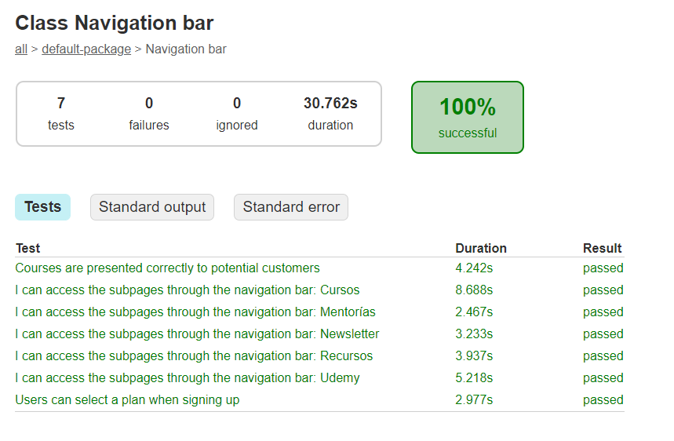
 Pueden jugar con los botones de esta página.

>[!TIP]  
> Los `Background` no deben tener mas de dos steps, sino hay un problema de
> estructuración.

## Paso 49
>[!NOTE]  
>Mejorar los steps permitiendo usar uno u otro texto.

1. En el archivo **FreeRangeSteps.java**, cambiar esto:
`@And("I select Introduction to Testing")`, por esto:
`@And("(I|The user|The client) (select|selects) Introduction to Testing")`.
2. En el archivo **FreeRangeSteps.java**, cambiar esto:
`@Then("I can validate the options in the checkout page")` por esto:
`@Then("(I|The user|The client) can validate the options in the checkout page")`.
3. En el archivo **FreeRangeSteps.java**, cambiar esto:
`@When("I select Elegir Plan")` por esto:
`@When("(I|The user|The client) (select|selects) Elegir Plan")`.
4. Podemos jugar en el archivo **FreeRangeNavigation.feature** y cambiar
esto: `And I select Introduction to Testing`, por esto:
`And The user select Introduction to Testing`.
5. Tambien podemos cambiar en el archivo **FreeRangeNavigation.feature** esto:
 `Then The client can validate the options in the checkout page`, por esto:
`Then The client can validate the options in the checkout page`.
6. Cambie en **TestRunner.java** el `tag`por este:`tags = "@Courses"`, solo
requiero ejecutar los q he hecho cambios.
7. Lo podemos probar ejecutando desde **TestRunner.java** o el comando 
`gradle test` en cualquier `TERMINAL`.

>[!CAUTION]  
>Hasta acá tengo errores y no reconoce los cambios hechos. Páginas consultadas
>* [Gherkin: Grouping the steps using | (pipe symbol) ](https://self-learning-java-tutorial.blogspot.com/2018/05/gherkin-grouping-steps-using-pipe-symbol.html).
>* [Cucumber and Scenario](https://www.baeldung.com/cucumber-scenario-outline).

>[!TIP]  
> Hice cambios en el **settings.json**
>```json
>    "cucumberautocomplete.strictGherkinCompletion": true,
>    "cucumberautocomplete.strictGherkinValidation": false,
>    "cucumberautocomplete.gherkinDefinitionPart": "(Given|When|Then|And)\\(",
>    "cucumberautocomplete.smartSnippets": true,
>    "cucumberautocomplete.stepsInvariants": true,
>    "cucumberautocomplete.skipDocStringsFormat": true,
>    "cucumberautocomplete.formatConfOverride": {
>        "And": 3,
>        "But": "relative",
>    },
>    "cucumberautocomplete.onTypeFormat": true,
>    "cucumberautocomplete.customParameters": [
>        {
>            "parameter":"$",
>            "value":"\\$"
>        }
>    ],
>```
> Despues de estos cambios se debe cerrar y abrir el Visual Studio Code.

## Paso 51

>[!NOTE]  
> Resulta q hasta acá el no va a ejecutar de forma satisfactoria las pruebas
> con las nuevas expresiones regulares, entonces en este, vamos a buscar como
> poner a funcionar estas pruebas.

1. En el Archivo **FreeRangeSteps.java**, añadimos a la expresión regular
un signo de prgunta y dos puntos `?:`.
2. En el mismo **FreeRangeSteps.java**, cambiamos `(select|selects)` por
`selects?`.
3. Añadimos antes del `(?:)` un símbolo llamado *circunflejo* `^` y al final
 un signo *pesos* `$`, quedando así las líneas donde está la expresión regular:
 ```java
     @When("^(?:I|The user|The client) selects? Elegir Plan$")
    ...

    @And("^(?:I|The user|The client) selects? Introduction to Testing$")
    ...

    @Then("^(?:I|The user|The client) can validate the options in the checkout page$")
    ...
 ```
4. Lo podemos probar ejecutando desde **TestRunner.java** o el comando 
`gradle test` en cualquier `TERMINAL`.
```diff
+BUILD SUCCESSFUL in 20s
3 actionable tasks: 2 executed, 1 up-to-date
```

## Paso 53

>[!NOTE]  
> Es probable q el reporte a ver basado en una API, no esté disponible para
> ser utilizado por todas las empresas, y puede estar bloqueado.

1. Ingresa a este sitio [Cucumber Reports](https://reports.cucumber.io/).
2. Establecer un login con la cuenta de [GitHub](https://github.com/).

>[!TIP]  
> Si no tienes cuenta en GitHub, crear una nueva usando tu correo personal
> puede ser tu correo personal de *gmail*, ejemplos de ayuda:
>* [Como crear una cuenta de github 2023](https://www.youtube.com/watch?v=Y1zoHt1UMq0&t=20s).
>* [CÓMO CREAR una cuenta de GITHUB](https://www.youtube.com/watch?v=jwFSIEi_d7E&t=74s).

3. Proceder con la autorización a "SmartBear"  
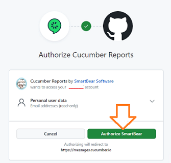

4. Debe llegar a esta página despues de un rato de espera  
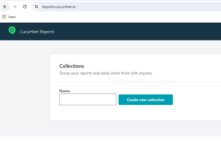

5. Escribir en el cuadro de "Name" de las Collections el texto: 
"SeleniumFreeRange" y presionar el botón de **"Create new Collection"**.
6. El te lleva a una página donde te muestra un TOKEN, por favor almacenarlo aparte. Se sugiere crear un archivo llamado **.env** y almacenar dicha
 información ahí.

>[!CAUTION]  
> Se puede almacenar el TOKEN en el archivo llamado **.env** y tener
> la precaución de __NO SUBIR__ ⬆️ este  al repositorio.  
> Este TOKEN es secreto y no debe ser compartido por error.  
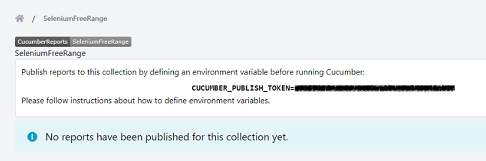 

>[!TIP]  
> En el archivo **.gitignore**, le agregué esto para evitar se suba por 
>equivocación el archivo **.env** donde almacené el TOKEN:
>```dotenv
># dotenv environment variable files
>.env
>.env.development.local
>.env.test.local
>.env.production.local
>.env.local
>```

7. Como estamos utilizando Windows como sistema Operativo, añadimos a las variables de Ambiente una nueva llamada `CUCUMBER_PUBLISH_TOKEN` y le asignamos el valor del TOKEN obtenido en la página anterior.
8. Pasos luego de abrir las "Variables de Ambiente" o "Environment...":
    1. Dar el **New** en la parte de abajo (System variables).
    2. Escribir el nombre y el TOKEN.
    3. Dar **OK**.
    4. Dar el **OK** final de **`Environment Variables`**.
    5. Y Dar el último **OK** de la ventana de **`System Properties`**.  
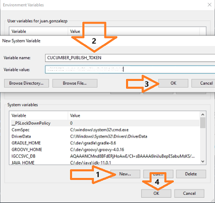

9. Cerramos y reabrimos el "Visual Studio Code", y dependiendo de la terminal escribimos el comando:  
    >`Powershell`
    ```powhershell
    $env:CUCUMBER_PUBLISH_TOKEN
    ```
    >`Command Prompt`
    ```dos
    echo %CUCUMBER_PUBLISH_TOKEN%
    ```
    >`bash`
    ```bash
    echo $CUCUMBER_PUBLISH_TOKEN
    ```

10. Creamos un archivo llamado **cucumber.properties**, dentro de la carpeta 
"src/test/resources", con el texto:
```xml
cucumber.publish.enabled=true
```
11. Ejecuto la prueba desde cualquier `TERMINAL` con el comando de 
`gradle test` o desde el triángulo de **TestRunner.java** y luego voy a la
página [Cucumber Reports](https://reports.cucumber.io/) e ingresamos a la
colección q bautizamos como: "SeleniumFreeRange", nos aparece nuestro primer
reporte.  
Jugamos y le damos click en varias partes para conocer este nuevo reporte.

## Paso 55

1. Creamos un archivo llamado **Hooks.java** dentro de la carpeta 
"src/test/java/steps".
2. Extendemos de `BasePage`, por ende el importa `import pages.BasePage;`:
```java
public class Hooks extends BasePage {
  
}
```
3. Añadimos dentro de esta clase el constructor:
```java
  public Hooks(){
    super(driver);
  }
```
4. Invocamos un proceso para ser ejecutado al final es decir un `@After`, 
el va a importar `import io.cucumber.java.After;`, con una funcion llamada
`tearDown` y un parámetro de tipo `Scenario` e importar 
`import io.cucumber.java.Scenario;`:
```java
  @After
  public void tearDown(Scenario scenario){
  } 
```
5. Ponemos una condicional basado en el parámetro `scenario`:
```java
    if (scenario.isFailed()){
    }
```
6. Y dentro de la condicional, solo mostramos un log: `scenario.log("Scenario failing, please refer to the image attached to this report");`.
7. Finalizamod con una variable de tipo `byte[]` llamada `screenshot`, el
 debe de importar dos `import org.openqa.selenium.OutputType;`y 
`import org.openqa.selenium.TakesScreenshot;`:
```java
      final byte[] screenshot = ((TakesScreenshot) driver)
          .getScreenshotAs(OutputType.BYTES);
```
8. Añadir al `scenario` el valor de la imagen obtenida:
```java
     scenario.attach(screenshot, "image/png", "Screenshot of the error");
```
9. Hacemos un cambio en **FreeRangeSteps.java** en la linea 57, cambiando
 esto: `"Academia: $16.99 / mes \u2022 11 productos",`, por esto:
 `"Academia: $26.99 / mes \u2022 11 productos",`.

10. Ejecuto la prueba desde cualquier `TERMINAL` con el comando de 
`gradle test` o desde el triángulo de **TestRunner.java** y luego voy a la
página [Cucumber Reports](https://reports.cucumber.io/) e ingresamos a la
colección q bautizamos como: "SeleniumFreeRange", y revisamos el mas
reciente reporte.
```diff
-BUILD FAILED in 26s
3 actionable tasks: 3 executed
```

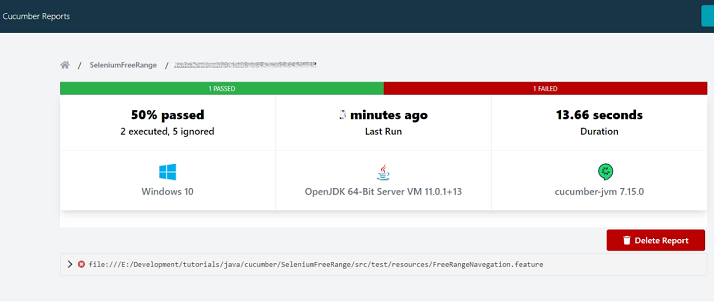

## Paso 57 a Paso 67
>[!NOTE]  
> Esto es un breve repaso de todos los pasos q hicimos anteriormente
> Precondiciones:
> * Java 11 instalado
> * Gradle instalado
> * Visual Studio Code
>
> De otro lado el proceso totalmente manual de configuración de 
>**build.gradle**.
> Lo mismo q los *Troubleshootings* entre VSCode y JDK/Gradle.  
> Voy a crear de nuevo el proyecto

1. Borro todo el contenido de la carpeta "SeleniumFreeRange"
2. Creo un nuevo proyecto con [Ctrl][Shift][P].
3. Seleccionar `Java: Create Java Project`.
4. Seleccionamos "Gradle".
5. La carpeta es la misma de "SeleniumFreeRange".
6. Después "Groovy".
7. Y el nombre de "SeleniumFreeRange".
8. Corremos en la `TERMINAL` el `gradle clean` y luego el 
`gradle build`.
9. De nuevo [Ctrl][Shift][P], para ver `java: Configure Java Runtime`.

## Paso 68
1. Sacamos la carpeta "src" y el archivo **build.gradle** a la raiz del proyecto y borramos la carpeta sobrante "app".
2. Creamos el archivo **Google.feature** dentro de la carpeta 
"src/test/resources", con este texto:
```feature
Feature: Probar la busqueda en Google

  Scenario: Busco algo en Google
  Given navegar a google
  When busco algo
  Then obtengo resultados
```
3. Corregimos el **build.gradle** de la siguiente manera:
```gradle
plugins {
    id 'java'
}

group 'CursoUdemy'
version '1.0-SNAPSHOT'

sourceCompatibility = 11

repositories {
    mavenCentral()
}

dependencies {
    // https://mvnrepository.com/artifact/org.seleniumhq.selenium/selenium-java
    implementation group: 'org.seleniumhq.selenium', name: 'selenium-java', version: '4.18.1'
    // https://mvnrepository.com/artifact/io.cucumber/cucumber-java
    implementation group: 'io.cucumber', name: 'cucumber-java', version: '7.15.0'
    // https://mvnrepository.com/artifact/io.cucumber/cucumber-junit
    testImplementation group: 'io.cucumber', name: 'cucumber-junit', version: '7.15.0'

}
```
4. Dentro de "src\test\java" borramos la carpeta "seleniumfreerange".
5. Dentro de "src\main\java" borramos la carpeta "seleniumfreerange".
6. En la `TERMINAL` ejecutamos el `gradle clean` y luego el 
`gradle build`.
```diff
+BUILD SUCCESSFUL in 1s
2 actionable tasks: 2 executed
```

## Paso 69
1. Ajusto el archivo **Google.feature**:
```feature
Feature: Test Google seach functionality

Scenario: As a user I enter a search criteria in Google
  Given I am on the Google search page
  When I enter a search criteria
  And click on the search button
  Then the results match the criteria
```
2. En la carpeta "src/test/java", crear dos carpetas "pages" y "steps".
3. Mover el archivo **Google.feature** a una nueva carpeta en 
"src/test/resources/features".
4. Crear el archivo **GoogleSteps.java** dentro de "src/test/java/steps", 
con este contenido inicial:
```java
package steps;

public class GoogleSteps {
  
}
```
5. Colocamos un `@Given` e importamos `import io.cucumber.java.en.Given;`,
dentro de **GoogleSteps.java**
6. Añadimos al **build.gradle** dos dependencias mas:
```gradle
    // https://mvnrepository.com/artifact/junit/junit
    testImplementation group: 'junit', name: 'junit', version: '4.13.2'
    // https://mvnrepository.com/artifact/org.slf4j/slf4j-api
    implementation group: 'org.slf4j', name: 'slf4j-api', version: '2.0.12'
```
7. Completamos en **GoogleSteps.java** la sintaxis del `@Given`:
```java
  @Given("^I am on the Google search page$")
  public void navigateToGoogle(){

  }
```
8. En **GoogleSteps.java** completemos los demás `@When`, `@And` y `@Then`:
```java
  @When("^I enter a search criteria$")
  public void enterSearchCriteria(){

  }

  @And("^click on the search button$")
  public void clickSearchButton(){

  }

  @Then("^the results match the criteria$")
  public void validateResults(){

  }
```
9. Cambiamos la importación de cada uno de `import io.cucumber.java.en`,
por uno solo de todo `import io.cucumber.java.en.*;`.
10. Creamos una carpeta llamada "runner" dentre de "src\test\java".
11. Creamos el archivo **Runner.java** dentro de "src/test/java/runner".
12. Del archivo **Runner.java** añadimos antes de `class`:
```java
package runner;

import org.junit.runner.RunWith;

import io.cucumber.junit.Cucumber;
import io.cucumber.junit.CucumberOptions;

@RunWith(Cucumber.class)
@CucumberOptions(
  features = "src/test/resources/features",
  glue = "src/test/java/steps"
)

public class Runner {
  
}
```
13. Al lado izquierdo en **Runner.java** nos aparece un triángulo verde, 
para que podamos hacer `run` o `debug`.

>[!WARNING]  
> Recuerden q como tenemos una variable de ambiente llamada 
> `CUCUMBER_PUBLISH_TOKEN`, el reporte pasa al sitio 
> [Cucumber Reports](https://reports.cucumber.io/), si lo quieren local
> simplemente borren esa variable de ambiente y reinicien el Visual Studio
> Code.

14. Debido a una advertencia q sale en el `DEBUG CONSOLE`, se cambia el 
`glue` a este mas sencillo, dado q lo busca basado en el `package`:
```java
@CucumberOptions(
  features = "src/test/resources/features",
  // glue = "src/test/java/steps"
  glue = "steps"
)
```

## Paso 70
>[!NOTE]  
> Explicación del P.O.M. Page Object Model, como patrón de diseño.

## Paso 71
>[!NOTE]  
Configuración de ChromeDriver en Windows y MacOS.
Previo a la creación la clase principal en la próxima clase, sobre la que las demás clases de nuestro Page Object Model van a descansar y heredar, tienen que prestar atención a esta clase sobre cómo configurar ChromeDriver tanto en Windows como Mac! 
>
>Una nota rápida para los usuarios de Windows y Mac sobre cómo especificar la ruta al ChromeDriver.
>
>**En Windows:**
>Dentro del bloque estático que creamos en BasePage.java, añadan la siguiente línea: 
>```java
>System.setProperty("webdriver.chrome.driver", "/path/to/chromedriver");
>```
>Solo tienen que cambiar la ruta a donde tienen descargado el chromedriver!
>
>**En MacOS:**
>1. Abran la Terminal.
>2. Ejecuten "sudo nano /etc/paths".
>3. Les va a pedir la contraseña, pónganla.
>4. Vayan al final del archivo y agreguen el path de, en este caso, WebDriver.
>5. En mi caso es "/users/MiNombre/Documents/WebDriver"
>6. Hagan Control + x para salir.
>7. Presionen `Y`  para salvar.
>8. Presionen Enter para confirmar.
>
>Para chequear que quedó bien, cierren y vuelvan a abrir la terminal y ejecuten "echo $PATH". Deberían poder el nuevo path que agregaron junto a los otros.

## Paso 72
1. Crear el archivo **BasePage.java** dentro de "src/test/java".
2. Creamos la variable `driver` de tipo `WebDriver`, e importa 
`import org.openqa.selenium.WebDriver;`.
3. Creamos la variable `wait` de tipo `WebDriverWait`, e importa
`import org.openqa.selenium.support.ui.WebDriverWait;`.
4. Creamos un elemento estático llamado `chromeOptions` e importa
`import org.openqa.selenium.chrome.ChromeOptions;`.
5. Al `driver` le asignamos el `ChromeDriver` y al `wait` se le
asigna el `WebDriverWait`.
6. Creamos el `Constructor`, asi sería el resultaodo hasta el momento de
**BasePage.java**:
```java
package pages;

import java.time.Duration;

import org.openqa.selenium.WebDriver;
import org.openqa.selenium.chrome.ChromeDriver;
import org.openqa.selenium.chrome.ChromeOptions;
import org.openqa.selenium.support.ui.WebDriverWait;

public class BasePage {

  // Definicón de las variables a utilizar
  protected static WebDriver driver;
  private static WebDriverWait wait;

  // Instanciamos las variables
  static {
    ChromeOptions chromeOptions = new ChromeOptions();
    driver = new ChromeDriver(chromeOptions);
    wait = new WebDriverWait(driver, Duration.ofSeconds(10));
  }

  // Definición del Constructor
  public BasePage(WebDriver driver){
    BasePage.driver = driver;
    wait = new WebDriverWait(driver, Duration.ofSeconds(10));
  }

  public static void navigateTo(String url){
    driver.get(url);
  }
}
```
7. Creamos el archivo **GooglePage.java** en "src/test/java/pages", y 
extendemos la herencia de `BasePage.`.
8. Ponemos el contructor basado en `BasePage`:
```java
  public GooglePage(){
    super(driver);
  }
```
9. Relizamos la Navegación
```java
  public void navigateToGoogle(){
    navigateTo("https://www.google.com");
  }
```
10. En **GoogleSteps.java** instanciamos el `GooglePage` e importar 
`import pages.GooglePage;`.
11. Añadimos `google.navigateToGoogle();` al `@Given` del archivo
**GoogleSteps.java**.
11. Ejecutamos la prueba desde **Runner.java**, debe abrir el browser a
google y ya.

## Paso 73
>[!TIP]  
> Como puede solucionar JVM (Java) desde la pagina de [Visual Studio Code](https://code.visualstudio.com/docs/java/java-tutorial).
> Luego dentro de Visual Studio Code instalamos las extensiones faltantes:
> * **Extension Pack for Java** de Microsoft.
> * **Gradle Extension Pack** de Richard Wills.
>
> Instalar el Gradle de esta página [Gradle](https://gradle.org/install/).
>
> Si el problema es q no aparece en **runner.java** la flecha verde o el 
> círculo para ejecutar, presionar las teclas [Ctrl][Shift][P], y seleccionar
> `Java: Clean Java Language Server Workspace`.

## Paso 74
>[!NOTE]  
> Explicación de que es un WebElement, y para mas información aquí:
>[Elements](https://www.selenium.dev/documentation/webdriver/elements/).

## Paso 75
>[!NOTE]  
> Explicación de Locators, y el recurso en español no está disponible, pero
> se puede acceder a este otro: [Locators](https://www.selenium.dev/documentation/webdriver/elements/locators/).

## Paso 76 a  80 
>[!NOTE]  
> Jugando con los WebElements de cualquier página HTML.
> * Locators por ID.
> * Locators por NAME.
> * Locators por CSS.
> * Locators por XPATH.

## Paso 81
> [!NOTE]  
> Extensión de Chrome se llama [ChroPath](https://addons.mozilla.org/es/firefox/addon/chropath-for-firefox/) , pero ya hemos usado antes una 
> extensión llamada [SelectorsHub](https://selectorshub.com/selectorshub/), que es mucho mejor. 

## Paso 82
1. En el archivo **BasePage.java**, creamos un método llamado `Find` 
que devolverá un `WebElement` y que sea `private`:
```java
  private WebElement Find(String locator){
    return wait.until(ExpectedConditions.visibilityOfElementLocated(By.xpath(locator)));
  }
```
2. Usando el `Find` empezamos a aprovecharlo en un Click:
```java
  public void clickElement(String locator){
    Find(locator).click();
  }
```
3. Creamos en **GooglePage.java** una variable `private` y de tipo `String`
llamada `searchButton` y le asignamos el valor `xPath` de ese botón.
4. En el Archivo **GooglePage.java**, aprovechamos el nuevo método del Click:
```java
  public void clickGoogleSearch(){
    clickElement(searchButton);
  }
```
5. Añadimos en **GoogleSteps.java**, el llamado al método de
 `clickGoogleSearch`.
6. Ejecutamos la prueba desde **Runner.java**, debe abrir el browser a
google, hacer el click (no se ve nada nuevo, pues no hemos escrito que buscar) y
 deja abierto el browser.

## Paso 83
1. Creamos en **BasePage.java** un método `public` llamado `writeElement`:
```java
  public void writeElement(String locator, String textToWrite){
    Find(locator).clear();
    Find(locator).sendKeys(textToWrite);
  }
```
2. Creamos en **GooglePage.java** una variable `private` y de tipo `String`
llamada `searchTextField` y le asignamos el valor `xPath` del criterio de
 búsqueda.
3. Añadimos un método en **GooglePaga.java**, de llamado `enterSeachCriteria`,
con un argumento para el texto a buscar:
```java
  public void enterSeachCriteria(String criteria){
    writeElement(searchTextField, criteria);
  }
```
4. Corregimos el `xPath` de `searchButton` en **GooglePage.java**.
5. En el archivo **GoogleSteps.java** añadimos el llamado al método de
`enterSeachCriteria` con el argumento `"Google"`, así quedan el `@Given`,
`@When` y `@And`:
```java
  @Given("^I am on the Google search page$")
  public void navigateToGoogle(){
    google.navigateToGoogle();
  }

  @When("^I enter a search criteria$")
  public void enterSearchCriteria(){
    google.enterSeachCriteria("Google");
  }

  @And("^click on the search button$")
  public void clickSearchButton(){
    google.clickGoogleSearch();
  }
```
6. Ejecutamos la prueba desde **Runner.java**, debe abrir el browser a
google, escribir el texto, hacer el click y dejar abierto el browser.

## Paso 84
1. En el archivo **BasePage.java** creamos un método para el manejo de 
dropdows, llamado `selectDropDownByValue`.
2. En el nuevo método, seleccionamos el elemento en la variable
`dropdown` y se importa `import org.openqa.selenium.support.ui.Select;`.
3. Usamos el `dropdown` para seleccionar por valor:
```java
  public void selectDropDownByValue(String locator, String valueToSelect){
    // Instanciamos el elemento del dropdown
    Select dropdown = new Select(Find(locator));
    // Usamos el dropdown
    dropdown.selectByValue(valueToSelect);
  }
```
4. En el archivo **BasePage.java** creamos un método para el manejo de 
dropdows, llamado `selectDropDownByIndex`.
5. Instanciamos la variable `dropdown` basada en el tipo `Select`.ñ
6. Usamos el `dropdown` para seleccionar por Índice:
```java
  public void selectDropDownByIndex(String locator, int index) {
    // Instanciamos el elemento del dropdown
    Select dropdown = new Select(Find(locator));
    // Usamos el dropdown
    dropdown.selectByIndex(index);
  }
```
7. Repetimos un nuevo método pero esta vez por texto:
```java
  public void selectDropDownByText(String locator, String valueToSelect) {
    // Instanciamos el elemento del dropdown
    Select dropdown = new Select(Find(locator));
    // Usamos el dropdown
    dropdown.selectByVisibleText(valueToSelect);
  }
```

>[!TIP]  
> Dado q en esta lección vamos a crear varios archivos para interactuar con una
>página de ejemplos de uso de automatización, el sitio que muestra el 
> instructor [Test and Quiz](https://testandquiz.com/selenium/testing.html)
>ya no existe, se sugiere esta otra página [Sample webpage](https://artoftesting.com/samplesiteforselenium).

8. Creamos el archivo **Sandbox.feature** en "src/test/resources/features":
```feature
@Test
Feature: Test different actions on a sandbox page.

Scenario: As a Test Engineer, I try out different actions on a sandbox page.
  Given I navigate to the sandbox page
  And select a value from the dropwdown
```
9. Creamos el archivo **TestSandBox.java** en "src/test/java/pages":
```java
package pages;

public class TestSandBox extends BasePage {

    // El locator para el dropdown
    private String dropdown ="//select[@id='testingDropdown']";

  // Usamos el Contructor del padre
  public TestSandBox() {
    super(driver);
  }

  // Vamos a relizar la Navegación
  public void navigateToSandbox() {
    navigateTo("https://artoftesting.com/samplesiteforselenium");
  }

    // Cambiamos del dropdown
    public void selectCategory(String text){
      selectDropDownByValue(dropdown, text);
    }
}
```
10. Creamos el archivo **TestSandboxSteps.java** en "src/test/java/steps":
```java
package steps;

import io.cucumber.java.en.*;
import pages.TestSandBox;

public class TestSandboxSteps {
  TestSandBox sandboxPage = new TestSandBox();

  @Given("^I navigate to the sandbox page$")
  public void navigateToTheSandboxSite() {
    sandboxPage.navigateToSandbox();
  }

  @And("select a value from the dropwdown$")
  public void selectState() {
    sandboxPage.selectCategory("Manual");
  }
}
```
11. En el archivo **Runner.java**, en las `@CucumberOptions`, añadimos un `tags`
```java
@CucumberOptions(
  features = "src/test/resources/features",
  // glue = "src/test/java/steps"
  glue = "steps",
  tags = "@Test"
)
```
12. Ejecutamos la prueba desde **Runner.java**, debe abrir el browser al 
sitio de pruebas y cambiar el dropdown y ya.

## Paso 85
1. En el archivo **BasePage.java**, creamos una variable llamada `action` del
tipo `Actions` y se importa `import org.openqa.selenium.interactions.Actions`.
2. Añadimos un método en **BasePage.java**, llamado `hoverOverElement`.
3. Dentro de `hoverOverElement`, añadimos un `action`:
```java
  public void hoverOverElement(String locator) {
    //Agreamos un `action`
    action.moveToElement(Find(locator));
  }
```
4. Añadimos un método en **BasePage.java**, llamado `doubleClickElement`.
5. dentro de `doubleClickElement`, añadimos un `action`:
```java
  public void doubleClickElement(String locator){
    // Agregamos el `action`
    action.doubleClick(Find(locator));
  }
``` 
6. Añadimos un método en **BasePage.java**, llamado `rightClickElement`.
7. dentro de `rightClickElement`, añadimos un `action`:
```java
  public void rightClickElement(String locator){
    // Agregamos el `action`
    action.contextClick(Find(locator));
  }
```
## Paso 86
1. Quitamos de **Sandbox.feature**, el primer `@Test` (línea 1).
2. Adiciono un nuevo Escenario en **Sandbox.feature**:
```feture
@Test
Scenario: As a Test Engineer, I want to retrieve the value of an static table.
  Given I navigate to the static table Then I can return the value I wanted
  Then I can return the value I wanted
```
3. Adicionar un método en **BasePage.java**, llamado `getValueFromTable`:
```java
  public String getValueFromTable(String locator, int row, int column) {
    // Encadenamos junto con el `locator` lo requerido para el dato en cuestión
    String cellINeed = locator + "/table/tbody/tr[" + row + "]/td [" + column + "]";
    // Devolvemos el texto interno
    return Find(cellINeed).getText();
  }
```
4. Crear un archivo **GridPage.java** en "src/test/java/pages":
```java
package pages;

public class GridPage extends BasePage {

  String grid = "//*[@id='root']/div/";

  // Usamos el Contructor del padre
  public GridPage(){
      super(driver);
    }

  public void navigateToGrid() {
    // Esta URL existe y es del sitio https://codesandbox.io/
    navigateTo("https://1v2njkypo4.csb.app/");
  }

  public String getValueFromGrid(int row, int col) {
    return getValueFromTable(grid, row, col);
  }
}
```

>[!TIP]  
> El sitio [simple-html-table-example(https://1v2njkypo4.csb.app/)](https://1v2njkypo4.csb.app/), se origina en [Sandbox](https://codesandbox.io/) y
> Este es el código fuente [blakestone95](https://codesandbox.io/p/sandbox/1v2njkypo4?file=%2Fsrc%2Findex.js).
>
>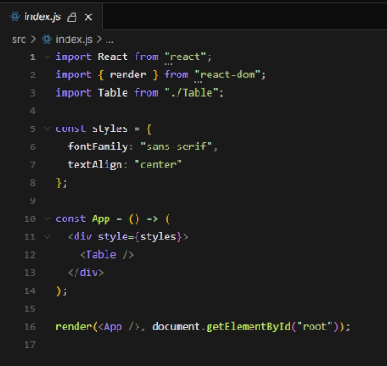
>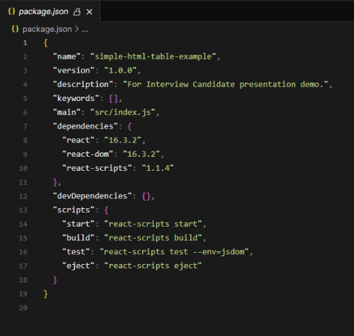
>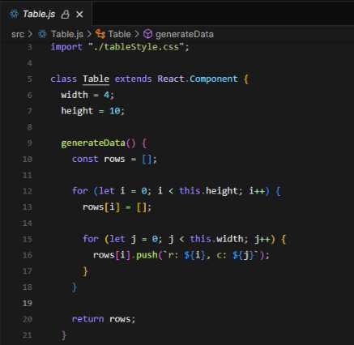
>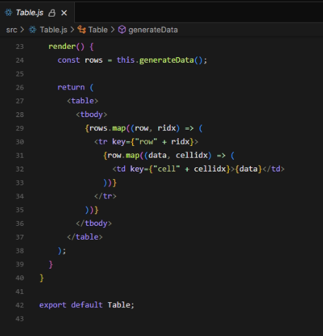
>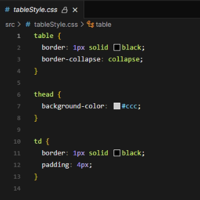
>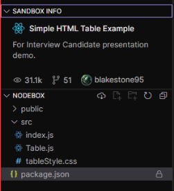

5. Crear un archivo **GridTestSteps.java** en "src/test/java/steps":
```java
package steps;

import cucumber.api.java.en.*;
import pages.GridPage;

public class GridTestSteps {

  GridPage grid = new GridPage();

  @Given("^I navigate to the static table Then I can return the value I wanted$")
  public void navigateToGridPage() {
    grid.navigateToGrid();
  }

  @Then("^I can return the value I wanted$")
  public void returnValue() {
    String value = grid.getValueFromGrid(3, 2);
    System.out.println(value);
  }
}
```
<a name="Debug-Console"></a>
6. Ejecutamos la prueba desde **Runner.java**, debe abrir el browser al
sitio de https://codesandbox.io/, luego el dato obtenido lo debes buscar abajo
en `DEBUG CONSOLE`:  


7. Adicionamos un método en **BasePage.java**, llamado `setValueOnTable`:
```java
  public void setValueOnTable(String locator, int row, int column, String text2Send){
     // Encadenamos junto con el `locator` lo requerido para el dato en cuestión
     String cell2Fill = locator + "/table/tbody/tr[" + row + "]/td [" + column + "]";
     // Llenamos la celda
     Find(cell2Fill).sendKeys(text2Send);
  } 
```

## Paso 87
>[!NOTE]  
> Lo que hicimos en el archivo **BasePage.java** con este tema: 
>`wait.until(ExpectedConditions.visibilityOfElementLocated(...));`
> es una **ESPERA EXPLÍCITA**, que espera el tiempo hasta q aparezca el elemento.
>
> Una **ESPERA IMPLÍCITA** obliga a esperar un tiempo determinado en todo,
> en este ejemplo `driver.manage().timeouts().implicitlyWait(10, TimeUnit.SECONDS);`, siempre va a esperar 10 segundos en cada paso,
> pero genera un error:  
> `The method implicitlyWait(long, TimeUnit) from the type WebDriver.Timeouts is deprecated`.

## Paso 88
>[!NOTE]  
> La espera prohibida es el **SLEEP**, ejemplo este `Thread.sleep(2000);`,
> se va a qiuedar esperando 2 segundos donde lo invoques, y el sugiere encerrar
> esto entre un try/catch, quedando así
>```java
>    try {
>      Thread.sleep(2000);
>    } catch (InterruptedException e) {
>      // TODO Auto-generated catch block
>      e.printStackTrace();
>    }
>```

## Paso 89
>[!NOTE]  
> ## Subir archivos en nuestra aplicación web con Selenium.
>Bienvenidos a una nueva clase! En este caso, al ser rápido y sin mucho concepto que explicar, voy a dejar este atípico caso que quizás les toque alguna vez y no muchos saben cómo resolver. Uno de mis padawans preguntó porque le tocó en el trabajo y es, a ciencia cierta, uno de esos momentos en los que al comienzo decís "me sentía confiado con esto de Automation pero...no tengo idea cómo resolver esto!".
>
>A qué me refiero? A hacer el upload de un archivo en una página. Y por qué es tan trágico? Porque una vez que hicimos el click con Selenium en el botoncito de Upload, nos aparece la ventana de Windows o Mac para buscar nuestro archivo. Y saben qué le dice esa ventanita a Selenium y su WebDriver?
>
>
>
>Pero...por qué es esto? Y mejor aún...cómo lo resolvemos? Eso vamos a aprender en esta clase!
>
> ## Selenium está muy perdido fuera del DOM.
>Como ustedes sabrán, Selenium es muy bueno para interactuar con elementos en páginas web. Tenemos muchas herramientas y maneras de localizarlos, enviar acciones sobre ellos y mucho más. Lamentablemente, esta ventana que acabamos de hacer aparecer al hacer click en el botón de Upload no pertenece al DOM, a la página web, sino que pertenece al sistema operativo de turno en el que nos encontremos trabajando.
>
>Selenium está atado de pies y manos. Es más...se va a tarar todo y no va a ser capaz de seguir ni de cerrar la instancia del browser, porque va a estar esta bendita pantalla en frente. Cómo solucionarlo? Bueno...prepárense porque esto no va a ser sencillo.
>
>### Primera solución: No siempre posible pero la más rápida.
>El caso más feliz que nos podemos encontrar (y el menos probable diría), es que el botón que nos lleva a la fatídica ventana del sistema operativo tenga como tipo "file" y sea un elemento "input".
>Este caso es el de Filebin por ejemplo.
>
>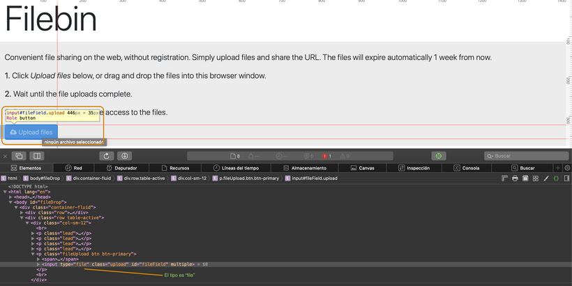
>
>En estos casos vamos a tener que hacer algo que no suena para nada intuitivo y nos va a tener dando vueltas en círculos si no se enteraban de cómo hacerlo.
>
>En estos casos lo único que vamos a necesitar es crear el webelement como ya vimos en los tutoriales y enviarle, con el método "sendKeys" de Selenium, el path definitivo del archivo. Si, ya se lo que están pensando. No tiene un campo de texto, a qué le estamos mandando entonces el texto?
>
>Lo que pasa acá es que cuando el sitio detecta que se le está mandando una ubicación de archivo (del tipo C:/MiCurriculum.docx), al elemento del tipo File, automáticamente procede a hacer el upload. Loco, no? Pero el problema es que el Type=File suele estar oculto y no vamos a tener cómo implementar esta solución. La alternativa? JavaScript. Si señores, para ser un Test Engineer todo terreno hay que saber un poco de todo. Así que ahora vamos a hacer uso de JavaScript para ejecutar lo necesario para hacer visible ese atributo!
>
>Vamos a tener que inyectar unos scripts para habilitar ese atributo, y para eso vamos a tener que usar la clase JavaScriptExecutor, la cual va a trabajar en sincronía con nuestro Driver de Selenium. El código se va a ver así:
>
>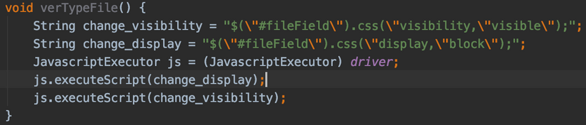
>
>Esto suele ser suficiente. Pero...cada maestro con su librito, y cada Dev puede tener diferentes maneras de esconder este elemento y molestar a Selenium, el cual es incapaz de encontrar al WebElement en caso de:
>
>* No estar visible.
>* No tener valores de ancho o alto.
>* Tener otro elemento cubriendo al que queremos acceder.
>
>Para eso tenemos que tirarle con todo lo que podamos usando JavaScript. Le tiras todas las inyecciones que tengas, no una porque vas a ser hábil Automation Tester y te comes un garrón de la san flauta.
>
>Vos estabas en un estado de codeo violento y locura. Lo reventaste a JS, le vaciaste todas los posibles argumentos de la función, le metes comentarios a todo y le ponés nombre de capítulos de Mi Familia es un Dibujo a toda variable y función para demostrar tu estado de locura y de inconsciencia temporal, me explico?
>
>Además tenés que tener un café de esos bien horribles de máquina que hay en toda empresa, te tomás 2 al hilo fríos y si tenés una jarra con caramelos en el box te la bajás. Vas así a la daily...sos inimputable hermano, en 10 días estás pusheando código directo al master de nuevo.
>
>Perdón, me fui por las ramas, les dejo todo lo que podemos ejecutar para intentar sortear lo que los devs hacen para esconder estos web elements con su tipo:
>
>*("#fileField").style.visibility="visible";*  
>*("#fileField").style.display="block";*  
>*("#fileField").style.width="200px";*  
>*("#fileField").style.height="200px";*  
>*("#fileField").style.position="fixed";*  
>*("#fileField").style.overflow="visible";*  
>*("#fileField").style.zIndex="999999";*  
>*("#fileField").style.top="500px";*  
>*("#fileField").style.bottom="500px";*  
>*("#fileField").style.left="500px";*  
>*("#fileField").style.right="500px";*  
>*("#fileField").style.marginBottom="100px";*  
>
>Creo que no me olvido de ninguno. Esta es una solución con la que di hace un tiempo en la comunidad Dev y me salvó las papas, como ahora espero les sirva a ustedes!

## Paso 90
1. En el archivo **BasePage.java** creo un método llamado `swithcToiFrame`:
```java
  public void swithcToiFrame(int iFrameIndex){
    // Usando el `driver` hacemos el cambio 
    driver.switchTo().frame(iFrameIndex);
  }
```
2. En el archivo **BasePage.java** creo un método llamado `switchToParentFrame`:
```java
  public void swithcToParentFrame(){
    // Usando el `driver` hacemos el cambio 
    driver.switchTo().parentFrame();
  }
```
3. En el archivo **BasePage.java** creo un método llamado `dismissAlert`:
```java
  public void dismissAlert(){
    // Usando el `driver` desactivamos la alerta
    driver.switchTo().alert().dismiss();
  }
```

## Paso 91
>[!NOTE]
>## OPCIONAL: Otra manera de manejar los WebElements en nuestro Page Object Model.
>Esta clase es opcional ya que representa OTRA MANERA de hacer lo que hicimos previamente en nuestras clases para página. En esta oportunidad vamos a aprender a utilizar PageFactory, una librería muy usada hoy en día en proyectos de automatización debido a la simplificación que supone para manejar nuestras clases de página.
>
>Recuerdan que estamos usando el Page Object Model (POM, por si les preguntan en una entrevista)? Bueno, esta librería lo que hace es darnos un par de trucos bajo la manga para que sea más fácil visualizar los webelements y tengamos que escribir menos código que lo que normalmente haríamos.
>
>De nuevo, para recordarles: El framework que hicimos hasta ahora NO NECESITA de PageFactory, de hecho funciona mejor, en mi opinión, y es más robusto. El tutorial apunta a que aprendan a usarlo porque se que es algo que le van a preguntar o exigir en muchos puestos de trabajo. Está en ustedes decir "No muchachos, tengo ésta manera de hacer las cosas que es mejor!" y PAF! Les muestran el framework que aprendieron acá. En caso que la idea no prenda, también habrán aprendido a usar Page Factory en esta clase.
>
>### Ahora si, manos a la obra! Instalemos las dependencias necesarias.
>Vamos por partes, lo primero que vamos a hacer es crear una clase, bajo el paquete que tenemos de Páginas (o el nombre que le hayan puesto al directorio donde están creando las clases para las páginas y donde está la BasePage). Le pueden poner el nombre que quieran, en este ejemplo, para verlo claro, le puse PageFactoryPage.  
>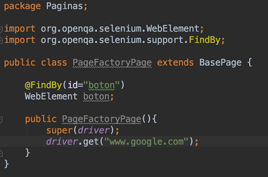
>
>Observemos un par de cosas acá. Primero y principal, estamos usando dos librerías que vienen con Selenium, las cuales son FindBy y WebElement por supuesto. Estamos usando acá WebElement porque les recuerdo que no estamos más creando el WebElement en la BasePage como lo hacemos en nuestro Framework principal. Es por eso que necesitamos crearlos en esta clase. Ven ya una de las diferencias? Van a estar necesitando poner esto en todas las clases de página.
>
>La clase que creamos va a extender la clase base de la misma manera para la construcción del WebDriver. Luego, vemos el corazón de PageFactory: la anotación @FindBy!
>
>Esta anotación lo que va a hacer es ahorrarnos la creación de WebElements de la manera que tradicionalmente se hace. Por defecto, busca id o name iguales a lo que le digamos, pero podemos especificar otras maneras de localizar los webelements, como XPath, CSS, etc.
>
>Usando la anotación, diciendo cómo se llama el campo por el cual vamos a encontrar el elemento y diciendo abajo WebElement además del nombre que queramos darle, vamos a tener creado nuestro WebElement listo para usarse.
>
>Ahora, otra cosa...como no tenemos la inicialización de los WebElements por ningún lado, nuestros tests van a fallar diciendo "che...no hay ningún WebElement por acá!".
>
>Para eso, vamos a añadir en la BasePage que estamos heredando en esta nueva clase que creamos, lo siguiente:
>
>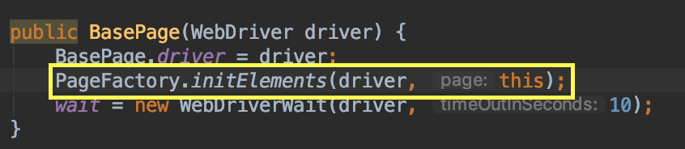
>
>En el constructor de la clase base, vamos a añadir lo que está en el recuadro. Esto va a permitir que, al instanciar las clases de página que heredan a ésta, los elementos con la anotación de PageFactory se inicialicen correctamente para ser usados.
>
>Eso es todo el misterio detrás de PageFactory. La dificultad que tiene la mayoría es en saber dónde inicializar los elementos. Pueden hacerlo en el constructor de la clase de la página, pueden hacerlo en las step definitions...aunque mi consejo es que lo hagan en la clase base que instancia el WebDriver para que siempre esté hecho y no tengan que acordarse de arrancarlo ustedes a mano en cada lado que lo quieran usar.
>
>De nuevo les recuerdo: Esto es una alternativa al Framework que hicimos hasta ahora. Mi preferencia personal es usar lo que les enseñé hasta ahora. Les estoy enseñando esta opción ya que es muy usado y requerido en la industria.
>
>Prueben ésto en el framework que (espero!) ya tienen creado, fíjense qué les resulta mejor y elijan lo que les sea más útil. Es un tema muy subjetivo y he aprendido con los años que no hay una única respuesta a todos los problemas!

## Paso 92

>[!NOTE]
>## PageFactory y un truco ingenioso.
>Bienvenidos a una nueva lectura en este curo! En esta oportunidad les traigo un truco muy sencillo pero que, sobre todo, quiero explicarles el fundamento detrás. Como recordarán, en la lectura anterior estuvimos viendo la librería de Page Factory, una manera muy usada de manejar las clases de página cuando hablamos de Page Object Model.
>
>Para los que no recuerden, son las anotaciones @FindBy para localizar webelements. Bueno, acá viene la parte teórica para que entiendan lo que vamos a hacer:
>
>Con PageFactory, nosotros necesitamos inicializar los webelements con la función initElements que nos provee. Al hacer eso, se abren los proxies que comunican con el webdriver (sea Chrome, Firefox o cualquiera) pero aún no se busca ningún elemento. Esto ocurre cuando cada uno de ellos es usado.
>
>Ahora bien, PageFactory lo que hace es enviar básicamente un request REST a la API de Selenium preguntando por este elemento...cada vez que lo tengamos que usar. Se imaginan que si hablamos de decenas de elementos siendo usados cientos de veces, el tiempo de ejecución se ve incrementado de manera significativa! Cómo podemos solucionarlo? Es que acaso los creadores de Selenium no pensaron en esta debilidad catastrófica?!? Tranquilos amigos y amigas! Que si lo hicieron y ofrecen una solución por demás sencilla.
>
>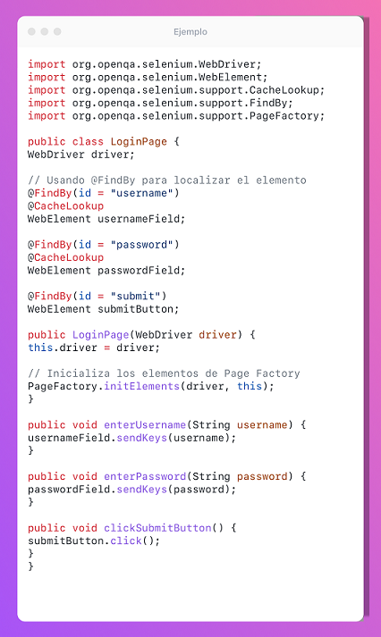
>
>Con ustedes, el **@CacheLookup!** Esta anotación, que la podemos poner arriba del @FindBy, arriba como en el caso de la screen, lo que hace es guardar en caché el elemento en cuestión para que, en posteriores usos, no tenga que hacerse esa llamada a la API de Selenium para buscar nuevamente algo que ya se había encontrado. Esto lo que hace es salvar preciosos segundos de ejecución que, si multiplicamos por casos de prueba, scenarios, ambientes y veces que se corre algo, termina generando una ganancia en tiempo para nada despreciable.
>
>### Pero esta solución también puede presentar un problema...
>Y es que, si estamos tratando de un elemento dinámico, como lo puede ser un contador, algo que una vez cargada la página cambia...vamos a recibir un StaleElementException. Por eso es que solamente deben usar esta técnica cuando se trata de elementos que sabemos que, una vez la página cargó, permanecen iguales. Si es algo dinámico como lo mencionado anteriormente, dejen todo como ya lo aprendimos para que el elemento sea ubicado nuevamente con sus nuevas características.
>
>### Conclusión
>Como podrán ver, es muy fácil de usar. Solo una anotación agregada y estamos listos para salvar segundos (o recibir excepciones inesperadas si no me hicieron caso!).
>
>Espero que les resulte útil y lo apliquen en sus proyectos!

## Paso 94
>[!TIP]  
> Dos opciones para hacer los `Assertion`, una en el el **BasePage.java**
> poniendo alli una función.  
> La otra manera es manejarlo dentro de **...Steps.java**, en el momento de 
> hacer el `@Then`.  
> Siendo la segunda, la q mejor se sugiere hacer.

1. En **BasePage.java** crear un método llamado `textFromElement`:
```java
  public String textFromElement(String locator) {
    return Find(locator).getText();
  }
```
2. En **GooglePage.java** creamos un método llamado `firstResult`:
```java
  public String firstResult() {
    return textFromElement(firstResult);
  }
```
3. Nos falta la variable `firstResult`, dentro de **GooglePage.java**.
4. En el **GoogleSteps.java** al `@Then` invocamos el `firstResult`, para 
compararlo con un valor esperado, usando un `Assert`:
```java
  @Then("^the results match the criteria$")
  public void validateResults() {
    Assert.assertEquals("", google.firstResult());
  }
```
>[!TIP]  
>Verificar que lo que debe importar es `import org.junit.Assert;`.

5. No corremos la prueba  en este paso.

## Paso 95
1. Modificamos el archivo **GridTestSteps.java**, en vez de imprimir el resultado 
lo comparamos con un `Assert`, 
[Imagen del Paso 86 para el valor esperado](#Debug-Console):
```java
  @Then("^I can return the value I wanted$")
  public void returnValue() {
    // Obtenemos la Celda
    String value = grid.getValueFromGrid(3, 2);
    // Comparamos con un `Assert`
    Assert.assertEquals("r: 2, c: 1", value);
  }
``` 
>[!TIP]  
>Verificar que lo que debe importar es `import org.junit.Assert;`.

2. Ejecutamos la prueba desde **Runner.java**, debe abrir el browser al
sitio de https://codesandbox.io/, luego el dato obtenido se compara con el 
esperado.

## Paso 96

1. Crear en **BasePage.java** un método llamado `elementIsDisplayed`:
```java
  public boolean elementIsDisplayed(String locator){
    return Find(locator).isDisplayed();
  }
```
2. Crear en **GridPage.java** un método llamado ``:
```java
  public boolean cellStatus() {
    return elementIsDisplayed(mainTable);
  }
```
3. Elimino el `@Test` del archivo **Sandbox.feature** y corrijo el escenario existente:
```feature
Scenario: As a Test Engineer, I want to retrieve the value of an static table.
  Given I navigate to the static table
  Then I can return the value I wanted
```
4. Corrijo en **GridTestSteps.java** el `@Given`:
```java
  @Given("^I navigate to the static table$")
  public void navigateToGridPage() {
    // Navegamos al sitio
    grid.navigateToGrid();
  }
```
5. Añado en **Sandbox.feature** un nuevo escenario con un tag:
```feature
@Test
Scenario: As a Test Engineer, I want to validate the static table is displayed.
  Given I navigate to the static table
  Then I can validate the table is displayed

```
6.  Adiciono un nuevo `@Then` en **GridTestSteps.java**:
```java
  @Then("^I can validate the table is displayed$")
  public void theTableIsThere(){
    // El compartivo debe dar falso y poner un mensaje
    Assert.assertFalse("Explotó todo", grid.cellStatus());
  }
```
7. Ejecutamos la prueba desde **Runner.java**, debe abrir el browser al
sitio de https://codesandbox.io/, y sacar el error `"Explotó todo"`.
8. Corregimos el `@Then` en **GridTestSteps.java**:
```java
  @Then("^I can validate the table is displayed$")
  public void theTableIsThere(){
    // El compartivo debe dar falso y poner un mensaje
    Assert.assertTrue("Explotó todo", grid.cellStatus());
  }
```
9. Ejecutamos la prueba desde **Runner.java**, debe abrir el browser al
sitio de https://codesandbox.io/, y salir de forma correcta.
10. Agregamos otra función en **BasePage.java**, para saber si el elemento está
disponible
```java
  public boolean elementIsEnabled(String locator){
    return Find(locator).isEnabled();
  }
```
11. Lo mismo en **BasePage.java** por si el elemento esta seleccionado:
```java
  public boolean elementIsSelected(String locator){
    return Find(locator).isSelected();
  }
```

## Paso 97
1. Eliminar el tag `@Test` de **Sandbox.feature**.
2. Adicionar un escenario en **Sandbox.feature**:
```feature
@Test
Scenario: As a Test Engineer, I want to validate that a text is present inside the list.
  Given I navigate to the list page
  When I search the list
  Then I can find the text in the list
```
3. Agregar en **BasePage.java** un método llamado `bringMeAllElements` e 
importar `import java.util.List;`:
```java
  public List<WebElement> bringMeAllElements(String locator){
    return driver.findElements(By.className(locator));
  }
```
4. Creamos una nueva clase llamada **ListPage.java** en "src/test/java/pages":
```java
package pages;

public class ListPage extends BasePage {
  // Usamos el Contructor del padre
  public ListPage() {
    super(driver);
  }
}
```
5. Crear dos variable y asignarles los valores en **ListPage.java**:
```java
  private String searchField ="//body/form[1]/input[1]";
  private String searchResults = "name";
```
6. Adiciono en **ListPage.java** dos funciones:
```java
  public void navigateToListPage() {
    navigateTo("https://andreidbr.github.io/JS30/06AjaxTypeAhead/index.html");
  }

  // Escribir el elemento para luego extraer la lista
  public void enterSearchCriteria() throws InterruptedException {
    Thread.sleep(600);
    writeElement(searchField, "Washington");
  }
```
7. En el archivo **ListPage.java**, se pone el método para traer todos los 
elementos de dicha lista:
```java
  public List<String> getAllSearchResults() {
    // Traigo WebElements de Selenium
    List<WebElement> list = bringMeAllElements(searchResults);
    // instancio una variable de tipo `List<String>`
    List<String> stringsFromList = new ArrayList<String>();
    // Debo convertirlos cada uno a `String` en el for
    for (WebElement e : list) {
      stringsFromList.add(e.getText());
    }
    // Devuelvo la lista de `String`
    return stringsFromList;
  }
```
8. Creamos el archivo **ListSteps.java** dentro de "src/test/java/steps":
```java
package steps;

public class ListSteps {
  
}
```
9. Instanciamos la variable `list` con base en la clase **ListPage.java**:
  `ListPage list = new ListPage();`
10. Se crean los `@Given`, `@When` y el `@Then`:
```java
  @Given("^I navigate to the list page$")
  public void navigateToListPage() {
    // Navegamos al sitio
    list.navigateToListPage();
  }

  @When("^I search the list$")
  public void searchTheList() throws InterruptedException {
    // Escribe el dato a buscar o el criterio
    list.enterSearchCriteria();
  }

  @Then("^I can find the text in the list$")
  public void theTableIsThere() {
    // Se obtiene toda la lista
    List<String> lista = list.getAllSearchResults();
    boolean textIsThere = lista.contains("Seattle, Washington");
    // Si cumple con hallar alguno de los criterios es OK, sino es error
    if (textIsThere) {
      System.out.println("The text is on the list: PASSED.");
    } else {
      throw new Error("The text is not on the list: FAILED!");
    }
  }
```

>[!CAUTION]  
> Tocó hacer algunos arreglos basados en que el sitio propuesto por el instructor
> [06AjaxTypeAhead](https://andreidbr.github.io/JS30/06AjaxTypeAhead/index.html)
> Ya no existe o genera error 404.  
> Entonces se debió cambiar la url a esta otra 
>[Complete List Of All US Cities](https://digitalmarketingwebdesign.com/complete-list-us-cities-cities-united-states/).  
> Abajo los cambios realizados:

11. En el archivo **ListPage.java**, las variables apuntan a otros elementos:
```java
  private String searchField = "//input[@type='search']";// "//body/form[1]/input[1]";
  private String searchResults = "column-2";// "name";
```
12. La navegacion en **ListPage.java**, es a otra url:
```java
  public void navigateToListPage() {
    // Este sitio ya no existe
    // navigateTo("https://andreidbr.github.io/JS30/06AjaxTypeAhead/index.html");
    // Probamos en este otro
    navigateTo("https://digitalmarketingwebdesign.com/complete-list-us-cities-cities-united-states/");
  }
```
13. Añadí en **ListPage.java** a modo de pruebas, pero luego lo puse en 
comentarios, el contenido de la lista que se puede ver en `DEBUG CONSOLE`
```java
  public List<String> getAllSearchResults() {
    // Traigo WebElements de Selenium
    List<WebElement> list = bringMeAllElements(searchResults);
    // instancio una variable de tipo `List<String>`
    List<String> stringsFromList = new ArrayList<String>();
    // int i = 0;
    // Debo convertirlos cada uno a `String` en el for
    for (WebElement e : list) {
      // System.out.println(String.format("%02d", i) + " " + e.getText());
      stringsFromList.add(e.getText());
      // i++;
    }
    // Devuelvo la lista de `String`
    return stringsFromList;
  }
```
14. En **ListSteps.java**, cambio el valor esperado del `@Then`:
```java
  @Then("^I can find the text in the list$")
  public void theTableIsThere() {
    // Se obtiene toda la lista
    List<String> lista = list.getAllSearchResults();
    // boolean textIsThere = lista.contains("Seattle, Washington");
    boolean textIsThere = lista.contains("Washington,Kansas,United States");
    // Si cumple con hallar el contenido es OK, sino es error
    if (textIsThere) {
      System.out.println("The text is on the list: PASSED.");
    } else {
      throw new Error("The text is not on the list: FAILED!");
    }
  }
```

## Paso 98
>[!TIP]  
> Definitivamente se debe mirar este paso o capítulo con detenimiento, para 
>aprovechar las herramientas para hacer *Debug* dentro de nuestro código.  
>Otros ejemplos que pueden consultar:
>* [Como usar el debug de VSCode con Java](https://www.youtube.com/watch?v=nN7ejSWHcO8).
>* [DEBUG 🪲 en Java ☕ con Eclipse 👨🏻_💻 Ejecutá tu CÓDIGO LÍNEA a LÍNEA 🐾](https://www.youtube.com/watch?v=FWaM8Ihz6pQ).
>* [Debugging Java with Visual Studio Code (VSCode)](https://www.youtube.com/watch?v=R1F5ihQKL4U).

## Paso 99
>[!NOTE]  
> Manejo de errores usando el `try{}catch(){}`.

## Paso 100
>[!NOTE]  
> Mejores prácticas para usar el _Page Object Model_.

## Paso 101
>[!NOTE]
> Importancia del archivo **runner.java**:  
> * Dice donde estan los archivo en lenguaje Gherking
> * Los *Steps* q traducen ese Huerking en lenguage `java`
> * Y otras condiciones.  
> **Gherkin** es un Lenguaje Específico de Dominio (DSL), que son lenguajes diseñados en concreto para resolver un problema muy específico. Y, en este caso, el problema que quiere solucionar Gherkin es un problema de comunicación entre los perfiles de negocio y los perfiles técnicos a la hora de trabajar bajo un enfoque BDD. También se podría trabajar Gherkin con otros enfoques de desarrollo de software, pero lo ideal y lo natural es hacerlo con BDD, al ser mejor práctica y para el enfoque de programación para el que se desarrolló Gherkin.   

1. En el archivo **runner.java** adicionamos dentro de la deficiión de la clase
lo siquiente e importamos `import org.junit.AfterClass;` e
`import pages.BasePage;`:
```java
public class Runner {
  @AfterClass
  public static void cleanDriver(){
    BasePage.closeBrowser();
  }
```
2. en el archivo **BasePage.java** Agregamos el método `closeBrowser`:
```java
  public static void closeBrowser(){
    driver.quit();
  }
```
3. Ejecutamos la prueba desde **Runner.java**, debe abrir el browser al
sitio de [Complete List Of All US Cities](https://digitalmarketingwebdesign.com/complete-list-us-cities-cities-united-states/), salir de forma correcta y finalmente cerrar
el browser.

## Paso 102
1. Creamos el archivo **StaticTableTest.feature** dentro de
 "src/test/resources/features".
2. Movemos los de **Sandbox.feature** al nuevo archivo:
```feature
Feature: Test different actions on Static Table page.

Scenario: As a Test Engineer, I want to retrieve the value of an static table.
  Given I navigate to the static table
  Then I can return the value I wanted

Scenario: As a Test Engineer, I want to validate the static table is displayed.
  Given I navigate to the static table
  Then I can validate the table is displayed
```
3. Añadimos en **StaticTableTest.feature** un `Background` y elemento, que se 
repite, en este caso el `Given` y el `@Test`;
```feature
@Test
Feature: Test different actions on Static Table page.

Background: Navigate to Table web app
  Given I navigate to the static table

Scenario: As a Test Engineer, I want to retrieve the value of an static table.
  Then I can return the value I wanted

Scenario: As a Test Engineer, I want to validate the static table is displayed.
  Then I can validate the table is displayed
```
4. Quitamos de **Sandbox.feature**, el `@Test`.
5. Ejecutamos la prueba desde **Runner.java**, debe abrir el browser al
sitio de [Code Sandbox](https://1v2njkypo4.csb.app/), salir de forma correcta y finalmente cerrar
el browser.

## Paso 103
>[!TIP]  
> La importacia de la reglas `Rule:`, se agrega en el archivo de ***.feature**
> paro el uso de mejores prácticas, ejemplo en **StaticTableTest.feature**:
>```feature
>Rule: The user can return values from the table and validate them.
>```

## Paso 104
>[!NOTE]  
> Explicación y ejemplo de los `tags`.

## Paso 105
1. Cambiamos el **StaticTableTest.feature**, de la siguiente manera:
```feature
@Grid
Feature: Test different actions on Static Table page.

Rule: The user can return values from the table and validate them.

Background: Navigate to Table web app
  Given I navigate to the static table

@Smoke @Regression
Scenario: As a Test Engineer, I want to retrieve the value of an static table.
  Then I can return the value I wanted

@Regression
Scenario: As a Test Engineer, I want to validate the static table is displayed.
  Then I can validate the table is displayed
```
2. Agregamos en **build.gradle**, lo siguiente al final:
```gradle
test {
    systemProperty "cucumber.options", System.getProperty("cucumber.options")
}
```
3. En una `TERMINAL` de `Git Bash` o  simplemente `bash`, ejecutamos este comando:
```bash
gradle test -Dcucumber.options="--tags @Grid"
```
Respuesta similar a esta:
```diff
+BUILD SUCCESSFUL in 9s
3 actionable tasks: 3 executed
```
4. Otro comando en la `TERMINAL` de `bash` podría ser:
```bash
gradle test -Dcucumber.options="--tags @Grid, --tags @Smoke"
```
y esta es la nueva respuesta:
```diff
+BUILD SUCCESSFUL in 1s
3 actionable tasks: 1 executed, 2 up-to-date
```
5. Agregamos en **Runner.java** esta opción:
```java
@CucumberOptions(
  features = "src/test/resources/features",
  // glue = "src/test/java/steps"
  glue = "steps",
  monochrome = true,
  tags = "@Test"
)
```
6. Ejecutamos el último comando de la `TERMINAL`.

## Paso 106
1. Creamos el archivo **ListPageTest.feature** dentro de
 "src/test/resources/features".
2. Cortamos de **Sandbox.feature** la parte de list test y la llevamos para
**ListPageTest.feature** añadiendo el tag `@List`:
```feature
Feature: I can find a city inside a state.

@List
Scenario: As a Test Engineer, I want to validate that a text is present inside the list.
  Given I navigate to the list page
  When I search the list
  Then I can find the text in the list
```
3. En el archivo **ListPage.java**, cambiamos el método `enterSearchCriteria`,
para q solicite un argumento `(String state)`.
```java
  public void enterSearchCriteria(String state) throws InterruptedException {
    Thread.sleep(600);
    writeElement(searchField, state);
  }
```
4. En el archivo **ListSteps.java** ponemos el argumento requerido y también lo pedimos en el método `searchTheList`:
```java
  public void searchTheList(String state) throws InterruptedException {
    // Escribe el dato a buscar o el criterio
    list.enterSearchCriteria(state);
  }
```
5. Completamos en **ListSteps.java**, el `@When`, así:
```java
 @When("^I search (.+) in the list$")
```
6. En el Archivo **ListPageTest.feature**, mejoramos el `When`:
```feature
  When I search <state> in the list
```
7. Añadimos un párametro para el método `theTableIsThere` de **ListSteps.java**:
```java
  public void theTableIsThere(String city) {
    // Se obtiene toda la lista
    List<String> lista = list.getAllSearchResults(); // "Washington,Kansas,United States"
    boolean textIsThere = lista.contains(city);
    // Si cumple con hallar el contenido es OK, sino es error
    if (textIsThere) {
      System.out.println("The text is on the list: PASSED.");
    } else {
      throw new Error("The text is not on the list: FAILED!");
    }
  }
```
8. Cambiamos el `@Then` de **ListSteps.java**:
```java
@Then("^I can find (.+) in the list$")
```
9. Cambiamos en **ListPageTest.feature** el paso de `Then`:
```feature
  Then I can find <city> in the list
```
10. Cambiamos el `Scenario` a `Scenario Outline`:
```feature
Scenario Outline: As a Test Engineer, I want to validate that a text is present inside the list.
```
11. Añadimos unos ejemplos en el archivo **ListPageTest.feature**:
```feature
  Examples:
      |state|city|
      |Washington|Washington,Kansas,United States|
      |Chicago|Chicago,Illinois,United States|
```
12. En el archivo **Runner.java**, cambiamos el tag a `@List` y ejecutamos desde
**Runner.java**.
13. Mejoro el `Scenario Outline:` de **ListPAgeTest.feature**:
```feature
Scenario Outline: As a Test Engineer, I want to validate that a <city> is present inside the <state>.
```
Cuando vuelvo a ejecutar de **Runner.java**, las descripciones son mas claras.

## Paso 107
>[!NOTE]  
>## Expresiones regulares en Cucumber: Cómo potenciar nuestra creación con ellas!
>### Expresiones Regulares: Qué son?
>Las expresiones regulares son esta cosa misteriosa que no muchos saben exactamente cómo usar. De hecho, muchísimos ingenieros de Test experimentados que yo conozco no tienen idea de cómo usarlas. Bien hecho, pueden darnos una flexibilidad impresionante en nuestros steps de Cucumber, permitiéndonos permutar y redirigir flujos de acción de acuerdo a cómo escribamos el step sin la necesidad de tener que hacer uno muy parecido por duplicado.
>### Tengo que usarlas como si no hubiese un mañana?
>Por favor, NO! De hecho, parte de las buenas prácticas que les enseño en esta clase son sobre no usar demasiado las expresiones regulares. Como regla general, uso lo siguiente:
>
>*Están bien si me dan una flexibilidad necesaria para no duplicar el step, pero no si no permite una clara legibilidad*
>
>Las expresiones regulares que nos van a servir en nuestras automatizaciones van a ser selectas, no muchas. Así que acá van las que más van a usar, cómo es su sintaxis y ejemplos!
>### Anclaje
>Para evitar la ambigüedad en la definición de los steps, usar anclas (anchors) correctamente es esencial. Pensemos sobre lo siguiente: La expresión
>```feature
>Given I log in
>```
>va a matchear también con la siguiente si no colocamos los símbolos de comienzo y fin:
>```feature
>Given I log in as an almighty admin
>```
>Y ambas significan cosas muy diferentes en la funcionalidad. Para eso, vamos a utilizar los siguientes símbolos, los cuáles van a delimitar el comienzo y fin del string que define al step.
>
>^ es usado para iniciar y $ para terminar. En definitiva, va a quedar:
>```feature
>Given ^I log in$
>```
>De esta manera, estamos evitando el famoso error de Ambiguous Match.
>### Comodines y cuantificadores.
>Vieron que cuando en un step definimos un término como un argumento que la función va a necesitar, en la clase de step defs nos aparece con unos símbolos estrambóticos? Bueno, esos son los comodines y cuantificadores. Por ejemplo:
>
>.* Esto nos va a matchear cualquier String que le mandemos.
>
>.+ Esto nos va a matchear uno o más de cualquier cosa.
>
>d* Esto nos va a matchear cualquier dígito.
>
>d+ Esto nos va a matchear uno o más dígitos.
>
>"[^"]*" Esta aberración nos va a matchear algo que está entre comillas dobles.
>
>an? Esto nos va a matchear un a o an y puede ir sin signo de pregunta. Tranquilos que vamos a verlo más claro en ejemplos.
> ### Grupos de captura: Identificando los argumentos en nuestros steps.
>Siempre que tengamos uno de esos comodines o cuantificadores entre paréntesis, significa que eso va a ser requerido como argumento en nuestra función que defina al step. Por ejemplo, tener
>```feature
>[Given(@"^I'm logged in as an? (.*)$")]
>```
>Va a significar que nuestra función va a requerir un String. También que podemos escribir el step como "I'm logged in as a customer" o "I'm logged in as an admin" ya que dijimos que a o an están ambas bien.
>
>Si tuviésemos:
>```feature
>[Given(@"^I have (d*)$")]
>```
>Estaría pidiendo por un solo dígito, como integer, en el argumento de la función que define este step. Para poder aceptar cualquier número, deberíamos escribir:
>```feature
>[Given(@"^I have (d+)$")]
>```
>Ahora, para ir cerrando...imaginemos que quiero establecer un opcional lógico pero no quiero que sea un grupo de captura. Osea, no quiero que eso signifique tener que agregar un nuevo argumento a la función. Por ejemplo, el siguiente caso:
>```feature
>When I log in as an admin Given I'm logged in as an admin
>```
>Ambos hacen lo mismo, pero están escritos diferente. Lo que puedo hacer es lo siguiente:
>```java
>[When(@"^(I'm logged|I log) in as an? (.*)$")]
>public void LogInAs(string role)
>{
>// código para el step
>}
>```
>Pero esto no va a buildear amigos. Saben por qué? Porque la función está pidiendo un solo argumento, el role, mientras que estamos capturando dos grupos: El primero es el OR lógico que tenemos aceptando **I'm logged** o **I log**. Como verán este opcional lógico se construye con el carácter | entre los paréntesis y el segundo es el String que viene después del an.
>
>Para solucionar ésto, vamos a necesitar agregar algo al grupo de captura que tenemos primero para que...bueno, no capture nada y no pida un argumento en la función.
>```java
>[When(@"^(?:I'm logged|I log) in as an? (.*)$")]
>public void LogInAs(string role)
>{
>// código para el step
>}
>```
>Como verán, la diferencia es sutil, muy sutil. Simplemente agregamos el ?: al comienzo del opcional lógico para indicar que no queremos que ésto se traduzca en un argumento requerido.
>### Conclusión y machete:
>Como verán, hay todo un submundo para la construcción de Steps de manera eficiente y prolija con Cucumber. También tengan en cuenta lo que les dije sobre evitar el abuso de estos recursos, lo que puede terminar resultando en frases Gherkin demasiado complejas, uno de los grandes problemas en mi opinión en cualquier proyecto de Automation. Para que vean que hay mucho más por cubrir, les voy a dejar el siguiente machete, cortesía de algún sitio web de Automation de la red de redes  
>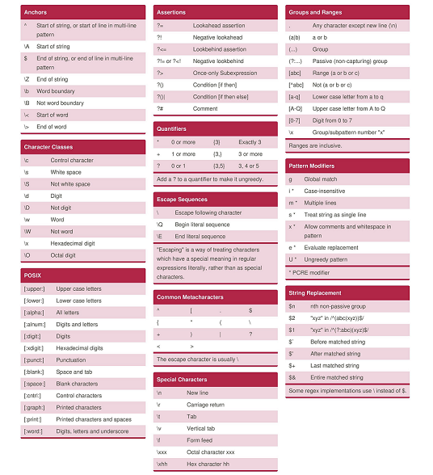
>[Expresiones Regulares](images/section14-step_107-exp-reg.png)

## Paso 108
>[!NOTE]  
> Explicacion y uso como una herramienta de colaboración.

## Paso 110
1. Crear el archivo **extent.properties** en la ruta "src/test/resources".
2. El contenido de este archivo será el siguiente:
```properties
extent.reporter.avent.start=false
extent.reporter.bdd.start=false
extent.reporter.cards.start=false
extent.reporter.email.start=true
extent.reporter.html.start=true
extent.reporter.klov.start=false
extent.reporter.logger.start=true
extent.reporter.tabular.start=false

extent.reporter.avent.config=
extent.reporter.bdd.config=
extent.reporter.cards.config=
extent.reporter.email.config=
extent.reporter.html.config=
extent.reporter.klov.config=
extent.reporter.logger.config=
extent.reporter.tabular.config=

extent.reporter.avent.out=test-output/AventReport/
extent.reporter.bdd.out=test-output/BddReport/
extent.reporter.cards.out=test-output/CardsReport/
extent.reporter.email.out=test-output/EmailReport/ExtentEmail.html
extent.reporter.html.out=test-output/HtmlReport/ExtentHtml.html
extent.reporter.logger.out=test-output/LoggerReport/
extent.reporter.tabular.out=test-output/TabularReport/
```
## Paso 111
1. En **build.gradle** añadir otra dependencia de [ExtendReports Cucumber7](https://mvnrepository.com/artifact/tech.grasshopper/extentreports-cucumber7-adapter/):
```gradle
// https://mvnrepository.com/artifact/tech.grasshopper/extentreports-cucumber7-adapter
implementation group: 'tech.grasshopper', name: 'extentreports-cucumber7-adapter', version: '1.14.0'
```
>[!TIP]  
> Tener presente q el curso q dicta el instructor tiene un tiempo y se usaba 
>"Cucumber 4", hoy trabajamos con "Cucumber 7" y se usa el adaptador con base
> en la versión actualizada, lo mismo el cambio en el **Runner.java**.

2. Añadir en **Runner.java** otra opción llamada `plugin` con esta extensa línea:
```java
@CucumberOptions(features = "src/test/resources/features",
    glue = "steps", 
    plugin = {"pretty",
      "com.aventstack.extentreports.cucumber.adapter.ExtentCucumberAdapter:",
      "timeline:test-output-thread/" }, 
    monochrome = true, 
    tags = "@List")
```
3. Ejecutamos comando en la `TERMINAL` de `bash`:
```bash
gradle test -Dcucumber.options="--tags @Grid, --tags @Smoke"
```
4. El reporte lo podemos buscar en la siguiente carpeta nueva 
"test-output/HtmlReport" con este nombre de archivo **ExtentHtml.html**.

## Paso 112
1. Creamos una clase llamada **Hooks.java** en la carpeta "src/test/java/steps":
2. Extendemos la clase de `BasePage`, por ende importamos `import pages.BasePage;`
```java
public class Hooks extends BasePage {
  // Ponemos el Constructor basado en el padre
  public Hooks() {
    super(driver);
  }
}
```
3. Invocamos un `@After`, q importa `import io.cucumber.java.After;` y
ponemos un método llamado `tearDown` con un argumento de tipo `Scenario` e
importamos `import io.cucumber.java.Scenario;` y `import java.io.IOException;`:
```java
  @After
  public void tearDown(Scenario scenario) throws IOException{

  }
```
4. Añadimos una dependencia en **build.gradle**, de [Apache Commons IO](https://mvnrepository.com/artifact/commons-io/commons-io)
para luego importar como `import org.apache.commons.io.FileUtils;`:
```gradle
    // https://mvnrepository.com/artifact/commons-io/commons-io
    implementation group: 'commons-io', name: 'commons-io', version: '2.15.1'
```
5. Colocamos un condicional si `scenario.isFailed()`, con cuatro tareas:
* Poner un log.
* Grabar el pantallazo en un archivo.
* A una variable de tipo `BYTE[]`, cargamos la imagen del archivo.
* Exponemos la imagen en el reporte.

Importamos lo siguiente `import java.io.File;` e `import org.apache.commons.io.FileUtils;`:
```java
    if (scenario.isFailed()) {
      // Añade el mensaje de error
      scenario.log("Scenario failed, please refer to the image attached to this report");
      // Alamacenamos el pantallazo en un archivo
      File sourcePath = ((TakesScreenshot) driver).getScreenshotAs(OutputType.FILE);
      // Ponemos el archivo en una variable 
      byte[] fileContent = FileUtils.readFileToByteArray(sourcePath);
      // La variable la voy a añadir al reporte
      scenario.attach(fileContent, "image/png", "Screenshot of the error");
    }
```
6. Añadimos elementos en **extent.properties**, para q se sepa donde va a quedar
el archivo resultante del pantallazo:
```properties
#Screenshot
screenshot.dir=test-output/HtmlReport/screenshots
screenshot.rel.path=./screenshots/
```
7. Provocamos una falla en **ListPageTest.feature** debajo de 
`Examples:`, añadiendo una nueva línea, de la siguiente manera (con espacios):
```feature
    |California|Adelanto, California, United States|
```
8. Ejecutamos comando en la `TERMINAL` de `bash`:
```bash
gradle test -Dcucumber.options="--tags @Grid, --tags @Smoke"
```
9. El reporte lo podemos buscar en la siguiente carpeta 
"test-output/HtmlReport" con este nombre de archivo **ExtentHtml.html**.

La imagen sería similar a esta:

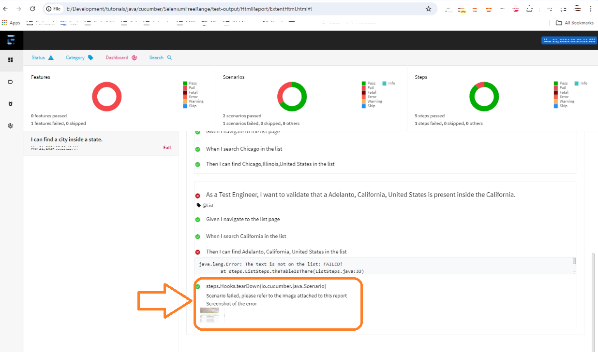

# Ejercicios

## Paso 113
## Ejercicio 1. Automation Engineer Assignment
### Overview
Complete the following automation test. This assignment can be done over the course of 2 days. Please make commits as often as possible so we can see the time you spent and please do not make all your changes in one big commit. We wil evaluate the code and time spent along with how your commits are split up.
Email your solution as soon as you have completed the challenge or the time is up.
### Key Goals
As a Customer when I search for Alexa, I want to see if the third option on the second page is available for purchase and can be added to the cart.
### Action
* GIVEN the user navigates to www.amazon.com
* AND Searches for 'Alexa'
* AND navigates to the second page
* AND selects the third item
## Expected Result
* THEN assert that the item would be available for purchase (the user would be able to add it to the cart)

_Please use Selenium to write and run your tests. You can use any language of your choice, but we prefer that you use Java. Avoid the usage of "canned tools such as the Selenium IDE app extension, QTP, etc. We expect you to write the tests manually yourself._

_Please place your code in a private Github repository and be prepared to give one of our testers access. Commit each step of your process so we can follow your thought process._

1. Creamos un archivo llamado **AmazonSearch.feature** dentro de
"src/test/resources/features" con esto:
```feature
@Amazon
Feature: Test Amazon search functionality

  @Cart
  Scenario Outline: As a Customer when I search for <Product>, I want to see if the third option on the second page is available for purchase and can be added to the cart.
    Given the user navigates to www.amazon.com
    And Searches for <Product>
    And navigates to the second page
    And selects the third item
    Then the user be able to add it to the cart

    Examples:
        |Product    | 
        |Alexa      |
        |Playstation|
```
2. Creamos un archivo llamado **AmazonSearchSteps.java** en la carpeta 
"src/test/java/steps", con el siguiente esqueleto:
```java
package steps;
import org.junit.Assert;

import io.cucumber.java.en.*;
public class AmazonSearchSteps {

  @Given("^the user navigates to www.amazon.com$")
  public void navigateToAmazon(){

  }

  @And("^Searches for (.+)$")
  public void enterSearchCriteria(String criteria){

  }
  @And("^navigates to the second page$")
  public void navigateToSecondPage(){

  }

  @And("^selects the third item$")
  public void selectThirdItem(){

  }

  @Then("^the user be able to add it to the cart$")
  public void itemCanBeAddedToChart(){

  }
  
}
```
3. Creamos un archivo llamado **AmazonSearchPage.java** dentro de
"src/test/java/pages", extendemos de `BasePage` con la respectiva 
importación de este, y añadimos el contructor basado en el padre, creando
un primer esqueleto como este:
```java
package pages;

public class AmazonSearchPage extends BasePage {

  // Usamos el Contructor del padre
  public AmazonSearchPage() {
    super(driver);
  }

}
```
4. Cambiamos en **Runner.java** el `tags` por el `@Amazon`.
5. En **AmazonSearchSteps.java** instanciamos a `AmazonSearchPage` una variable
llamada `amazon`, por ende se importa `import pages.AmazonSearchPage;`.
```java
  AmazonSearchPage amazon = new AmazonSearchPage();
```
6. Creamos un método llamado `navigateToAmazon` en **AmazonSearchPage.java** 
para luego ser llamado desde `navigateToAmazon` de **AmazonSearchSteps.java**.  

|AmazonSearchPage.java|AmazonSearchSteps.java|
|---|---|
|  public void navegateToAmazon(){<br>  navigateTo("https://amazon.com"); <br>} |   @Given("^the user navigates to www.amazon.com$")<br>    public void navigateToAmazon(){<br>   amazon.navegateToAmazon();  <br>} |

7. Creamos un método llamado `enterSearchCriteria` con el argumento
de `criteria` y la variable `searchBox` en **AmazonSearchPage.java** 
para luego ser llamado desde `enterSearchCriteria` de **AmazonSearchSteps.java**. 

|AmazonSearchPage.java|AmazonSearchSteps.java|
|---|---|
|  public void enterSearchCriteria(String criteria){<br>    writeElement(searchBox, criteria); <br>} |   @And("^Searches for (.+)$")<br>  public void enterSearchCriteria(String criteria) {<br>    amazon.enterSearchCriteria(criteria);  <br>} |

8. Creamos un método llamado `clickSearch` sin argumentos
y la variable `searchButton` en **AmazonSearchPage.java** 
para luego ser llamado desde `enterSearchCriteria` de **AmazonSearchSteps.java**. 

|AmazonSearchPage.java|AmazonSearchSteps.java|
|---|---|
|  public void clickSearch() {<br>   clickElement(searchButton); <br>} |   @And("^Searches for (.+)$")<br>  public void enterSearchCriteria(String criteria) {<br>    amazon.enterSearchCriteria(criteria);  <br> amazon.clickSearch(); <br>} |

9. Se añade un método en **BasePage.java**, para hacer uso del texto de un link:
```java
  public List<WebElement> gotoLinkText(String locator) {
    return driver.findElements(By.linkText(locator));
  }
```
10. Creamos un método llamado `goToPage2` sin argumentos
y la variable `linkText` en **AmazonSearchPage.java** 
para luego ser llamado desde `navigateToSecondPage` de **AmazonSearchSteps.java**. 

|AmazonSearchPage.java|AmazonSearchSteps.java|
|---|---|
|  public void goToPage2() {<br>    gotoLinkText(linkText); <br>} |   @And("^navigates to the second page$")<br>  public void navigateToSecondPage() { <br>    amazon.goToPage2(); <br>} |

11. Creamos un método llamado `pick3rdItem` sin argumentos
y la variable `thirdResult` en **AmazonSearchPage.java** 
para luego ser llamado desde `selectThirdItem` de **AmazonSearchSteps.java**. 

|AmazonSearchPage.java|AmazonSearchSteps.java|
|---|---|
|  public void pick3rdItem() {<br>    clickElement(thirdItem); <br>} |   @And("^selects the third item$") <br>  public void selectThirdItem() {<br>    amazon.pick3rdItem(); <br>} |

12. Creamos un método llamado `addToCart` sin argumentos
y la variable `addtoCartButton` en **AmazonSearchPage.java** 
para luego ser llamado desde `itemCanBeAddedToChart` de **AmazonSearchSteps.java**. 

|AmazonSearchPage.java|AmazonSearchSteps.java|
|---|---|
|  public void addToCart(){<br>    clickElement(addtoCartButton); <br>} |   @Then("^the user be able to add it to the cart$") <br>  public void itemCanBeAddedToChart() {<br>    amazon.addToCart(); <br>} |

13. Creamos un método llamado `addedToCartMessage` sin argumentos que
devuelve un `String` 
y la variable `addedMessageText` en **AmazonSearchPage.java** 
para luego ser llamado desde `itemCanBeAddedToChart` de **AmazonSearchSteps.java**. 

|AmazonSearchPage.java|AmazonSearchSteps.java|
|---|---|
|  public String addedToCartMessage(){<br>    return textFromElement(addedMessageText); <br>} |   @Then("^the user be able to add it to the cart$") <br>  public void itemCanBeAddedToChart() {<br>    amazon.addToCart(); <br> Assert.assertTrue(amazon.addedToCartMessage().contains("Agregado al carrito")); <br>} |

> [!IMPORTANT]  
>### Maximizar la Página para un resultado Correcto.  
>Adicioné al momento de alcanzar la página, un Maximizar de la Ventana
>en el archivo **BasePage.java** en el método `navigateTo`, porque sino
>obtengo un menú tipo Hamburguesa y para la prueba requiero el menú o barra
>de navegación completo con esto `driver.manage().window().maximize();`.

>[!NOTE]
>### Solución propuesta.
> Dado que en varias pruebas la selección de la página puede cambiar los 
>`xPath`, se debió poner opciones para varios de ellos en 
>**AmazonSearchPage.java**:
> * `goToPage2()`: Encontré hasta dos opciones diferentes, y las encapsulé en
> un `try-catch`.
> * `addToCart()`: Hallé tres opciones y se encapsularon en `try-catch`.
> * `getLanguage()`: Debí separar posibles repuestas en español o en inglés.
> * `addedToCartMessage()`: Habían cinco posibles respuestas para el producto.
> Las mismas que luego validé en `itemCanBeAddedToChart()` de 
>**AmazonSearchSteps.java**.
>
> El Primer ejercicio de _Amazon_, tiene varias posibles soluciones, y esta es una de
>ellas. El reporte sería similar a la imagen siguiente:
>
>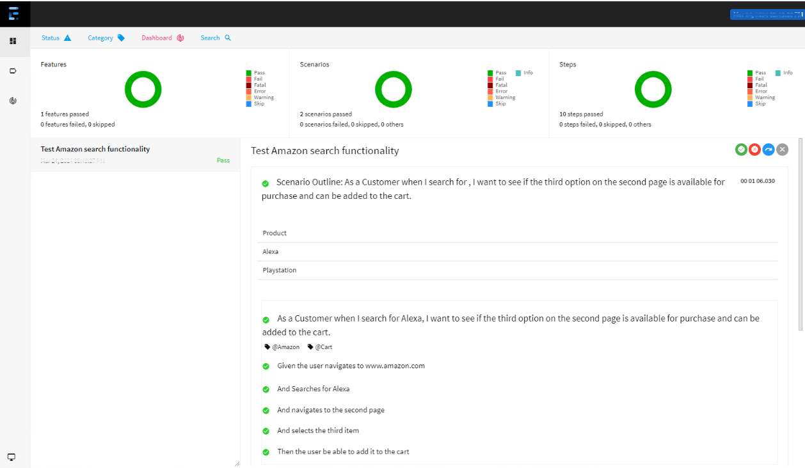

## Paso 114
## Ejercicio 2. 
### Coding test.
This is a test of how you go about producing a good, working, automation solution and how you consider and approach the different aspects of automation software. The tools and technologies are based on what we use at ACC.

* It consists of two main parts, two web based tests and one APItest.
* You do this test in your own time and you have up to **1 week** to submit the results. If you do need more time please contact me and this can be arranged.
* You only need to complete what you feel comfortable with but you should complete it by yourself.
* We do factor your experience into how we review the test.
* Seeing your approach and now you do things is more important than getting the right answer.
* Do as much as you can and submit your result even if it isn't finished or 'perfect' as a non working solution is better than no solution.
* We all get stuck at times and need help so do as much as you can, note any difficulties or questions so we can discuss your approach.
* Feel free to ask for clarification if needed.

The requirements are as follows:

1. Using the TradeMe website ([trademe](https://www.tmsandbox.co.nz/)) provide an automation solution that uses Selenium to verify the **number of named car makes available** in the **Make** drop down box on the **Cars** search tab on the **Motor** search page.
2. And provides the number of cars returned when you search for each of the following makes: Ferrari, BMW, Mazda and Honda.
3. Using the Trade Me API sandbox ([trademe](https://www.tmsandbox.co.nz/)) verify the **number of named car makes** available using the **tradeMe API**.
4. Code must be written in Java.
5. You solution needs to be put on [GitHub](www.github.com) so we can review it and download it.
6. Your solution should ise documented so we are able to build and run it.

### Notes and hints:
1. At ACC or framework/tests are written in Java with Maven or Gradle, using TestNG and with Selenium for Ul and Karate/RestAssured for API,
2. Use the real TradeMe site and Selenium for the UI tests.
3. Unfortunately the TradeMe sandbox for Ul is broken. As this test has to use the live site the number of search results will always be changing so just use the number that works on the day you write the test. Those tests failing because the number has changed is fine.
4. Use the TradeMe **sandbox** site for the APitests. The documentation is here:[trademe API Overview](https://developer.trademe.co.nz/api-overview/sandbox-environment)
5. The API test may be done with or without authenticating.
6. Consider how you would add more tests to your solution.
7. At ACC we use BDD in our automation frameworks (Cucumber).
8. At ACC all our automation is run via CICD pipelines (Azure Devops).
9. At ACC our framework includes logging and reporting (Extent).

Este se una imagen de captura del archivo **TradeMe.feature**:  
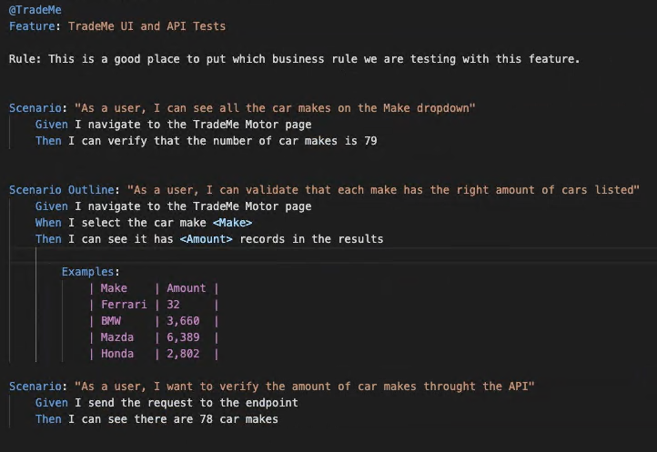

1. Creamos el archivo **TradeMe.feature**, dentro de
 "src/test/resources/features", con los requerimient básicos de este ejercicio:
```feature
@TradeMe
Feature: TradeMe UI and API Tests

Rule: This is a good place to put which business rule we are testing with this feature.

Scenario: "As a user, I can see all the car makes on the Make dropdown"
  Given I navigate to the TradeMe Motor page 
  Then I can verify that the number of car makes is 79

Scenario Outline: "As a user, I can validate that each make has the right amount of cars listed"
  Given I navigate to the TradeMe Motor page
  When I select the car make <Make> 
  Then I can see it has <Amount> records in the results
  Examples:
    | Make    | Amount  |
    | Ferrari |32       |
    | BMW     |3,660    |
    | Mazda   |6,389    |
    | Honda   |2,802    |

Scenario: "As a user, I want to verify the amount of car makes throught the API"
  Given I send the request to the endpoint 
  Then I can see there are 78 car makes
```
2. Creamos el archivo **TradeMePage.java** en la ruta 
"src/test/java/pages", con esto:
```java
package pages;

public class TradeMePage extends BasePage {
  private String makeDropdown = "(//select[@name='selectedMake'])";
  private String searchButton = "//button[@type='submit']";
  private String resultsLabel = "//h3 [@class='tm-search-header-result-count__heading ng-star-inserted']";

  public TradeMePage() {
    super(driver);
  }

  public void navigateToTradeMeMotor() {
    navigateTo("https://www.trademe.co.nz/a/motors");
  }

  public void selectMakeFromDropdown(String make) {
    selectDropDownByText(makeDropdown, make);
  }

  public void clickSearch() {
    clickElement(searchButton);
  }

  public int makeDropdownSize() {
    return dropdownSize(makeDropdown);
  }

  public String resultsAmount() {
    return textFromElement(resultsLabel);
  }
}
``` 
3. Añadimos un método requerido en **BasePage.java** llamado `dropdownSize`:
```java
  public int dropdownSize(String locator) {
    // Instanciamos el elemento del dropdown
    Select dropdown = new Select(Find(locator));
    // Tomamos las opciones del objeto `dropdwon`
    List<WebElement> dropdownOptions = dropdown.getOptions();
    // devolvemos el tamaño o `size`
    return dropdownOptions.size();
  }
```
4. Corrijo en **BasePage.java** el método `goToLinkText`:
```java
  public void goToLinkText(String linkText) {
    driver.findElement(By.linkText(linkText)).click();
  }
```
5. Creamos el archivo **TradeMeSteps.java** en 
"src/test/java/steps", con esto:
```javapackage steps;

import org.junit.Assert;

import io.cucumber.java.en.*;
import io.restassured.response.Response;
import io.restassured.response.ValidatableResponse;
import io.restassured.specification.RequestSpecification;
import pages.TradeMePage;
import static io.restassured.RestAssured.*;

import java.util.List;

public class TradeMeSteps {

  private ValidatableResponse json; //línea 16
  private static RequestSpecification request;
  private Response response;

  TradeMePage trademe = new TradeMePage();

  @Given("^I navigate to the TradeMe Motor page$")
  public void navigateToTradeMeMotor() {
    trademe.navigateToTradeMeMotor();
  }

  @When("^I select the car make (.+)$")
  public void selectMake(String make) {
    trademe.selectMakeFromDropdown(make);
  }

  @Then("^I can see it has (.+) records in the results$")
  public void printAmount(String expectedAmountOfResults) {
    trademe.clickSearch();
    Assert.assertTrue(trademe.resultsAmount().contains(expectedAmountOfResults));
    Assert.assertEquals("Showing " + expectedAmountOfResults + " results", trademe.resultsAmount());
  }

  @Then("^I can verify that the number of car makes is (\\d+)$")
  public void returnAmountOfMakes(int makeAmount) {
    int expectedAmount = makeAmount;
    int actualAmount = trademe.makeDropdownSize();
    Assert.assertEquals(expectedAmount, actualAmount);
  }

  @Given("^I send the request to the endpoint$")
  public void sendGETRequest() {
    request = given()
        .log().all()
        .param("", "");
  }

  @Then("^I can see there are (\\d+) car makes$")
  public void validateAmountOfMakes(int expectedMakeAmount) {
    response = request
        .when()
        .get("https://api.trademe.co.nz/v1/Categories/UsedCars.json");
    json = response.then().statusCode(200);
    List<String> jsonResponse = response.jsonPath().getList("Subcategories.Name");
    Assert.assertEquals("Mismatch on the expected total.", expectedMakeAmount, jsonResponse.size());
  }
}
```
6. Adicionar de (REST Assured)[https://mvnrepository.com/artifact/io.rest-assured/rest-assured], lo mas reciente en **build.gradle**:
```gradle
    // https://mvnrepository.com/artifact/io.rest-assured/rest-assured
    testImplementation group: 'io.rest-assured', name: 'rest-assured', version: '5.4.0'

```
>[!TIP]
> Muchas veces añadir dependencias requiere que se ejecute la limpieza del 
> ambiente de dos maneras:
> * Presionar las teclas [Ctrl][Shift][P], y seleccionar
> `Java: Clean Java Language Server Workspace`, o
> * En el Menú inferior izquierdo, seleccionar `JAVA PROJECT`, 
>luego los puntos suspensivos y ahí está `Clean Workspace`.

7. Cambiamos el `tags` de **Runner.java** a `@TradeMe`.
8. Hay un archivo nuevo llamado **test.yml**, esta es su image

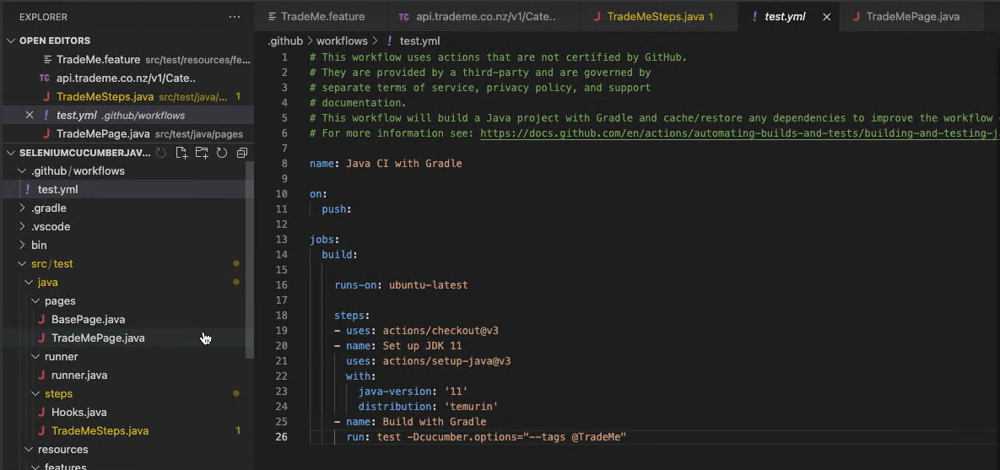
